# Dokumen Alur Sistem, Use Case, Activity, Sequence, dan ERD

## SIM Karang Taruna Dusun Tagog

| Informasi | Keterangan |
| --- | --- |
| Nama sistem | SIM Karang Taruna Dusun Tagog (`sim-tagog`) |
| Jenis aplikasi | Website pengelolaan organisasi + situs publik |
| Teknologi | Next.js 16 App Router, React 19, TypeScript, Tailwind CSS, Supabase (Postgres, Auth, Storage) |
| Sumber acuan | Kode di `src/`, migrasi di `supabase/migrations/`, dan panduan di `docs/` |
| Versi dokumen | 1.0 |
| Fungsi dokumen | Bahan analisis dan cetak biru pembuatan Use Case Diagram, Activity Diagram, Sequence Diagram, Flowchart, dan ERD |

---

## Daftar Isi

1. [Ringkasan Sistem](#1-ringkasan-sistem)
2. [Use Case Diagram](#2-use-case-diagram)
3. [Flowchart Alur Website dari Awal sampai Selesai](#3-flowchart-alur-website-dari-awal-sampai-selesai)
4. [Activity Diagram](#4-activity-diagram)
5. [Sequence Diagram](#5-sequence-diagram)
6. [ERD dan Rancangan Database](#6-erd-dan-rancangan-database)
7. [Matriks Ketertelusuran](#7-matriks-ketertelusuran)
8. [Catatan Implementasi dan Checklist Diagram](#8-catatan-implementasi-dan-checklist-diagram)

---

## 0. Cara Memakai Dokumen Ini

Dokumen ini sengaja memuat dua bentuk:

1. **Narasi dan tabel**: dipakai untuk menjelaskan logika sistem pada laporan atau presentasi.
2. **Kode diagram**: dipakai untuk langsung menghasilkan gambar.

Ketentuan tools:

- **Use Case Diagram** memakai **PlantUML** karena PlantUML mendukung aktor, boundary, `include`, dan `extend` secara standar.
- **Activity Diagram, Sequence Diagram, dan ERD** memakai **Mermaid** karena dapat dirender langsung di GitHub, GitLab, Notion, Obsidian, VS Code, atau <https://mermaid.live>.
- Jika dosen meminta draw.io, gunakan tabel dan narasi di dokumen ini sebagai acuan menggambar ulang.

> **Catatan penting tentang istilah "admin":** di aplikasi ini **tidak ada peran `admin` terpisah**. Peran yang dikenal sistem hanya:
>
> - `chairman` = **Ketua**
> - `treasurer` = **Bendahara**
> - `manager` = **Pengurus**
>
> Fungsi administratif di dalam website dipegang **Ketua**. Pembuatan akun baru dilakukan oleh **Admin Teknis** melalui Supabase Dashboard, bukan melalui halaman registrasi website.

---

## 1. Ringkasan Sistem

### 1.1 Tujuan Sistem

SIM Karang Taruna Dusun Tagog adalah sistem informasi untuk:

1. Mengelola **arsip dokumen** organisasi beserta riwayat versi berkas.
2. Mencatat **kas organisasi** (pemasukan dan pengeluaran) beserta bukti/nota.
3. Menghitung **saldo, rekap kategori, dan rekap bulanan** secara otomatis.
4. Menghasilkan **laporan PDF dan Excel** untuk pertanggungjawaban.
5. Mengelola **agenda kegiatan** yang dapat dipublikasikan ke warga.
6. Menyajikan **halaman publik** berisi agenda dan laporan kas tanpa login.
7. Menjaga **jejak aktivitas** perubahan data kas melalui log audit.
8. Menerapkan **hak akses berlapis** melalui UI, server action, dan Row Level Security (RLS) di database.

### 1.2 Batasan dan Prinsip Utama

- **Tidak ada registrasi mandiri.** Akun dibuat oleh admin teknis melalui Supabase Dashboard, lalu diatur perannya oleh Ketua.
- **Tidak ada hard delete** pada data operasional penting. Transaksi dan dokumen memakai *soft delete* (`deleted_at` atau `status = 'deleted'`) dan dapat dipulihkan.
- **Hak akses sebenarnya ditegakkan di database** melalui RLS dan trigger, bukan hanya dengan menyembunyikan tombol di UI.
- **Data publik memakai view khusus** (`public_*`) yang hanya membuka kolom aman. Tabel asli tetap tertutup untuk pengguna anonim.
- **Bukti/nota dan dokumen bersifat privat** di Supabase Storage. Akses unduh memakai *signed URL* berumur pendek.
- **Satu periode aktif saja.** Periode lama harus diarsipkan sebelum periode baru dibuat.
- **Pengeluaran manual wajib memiliki minimal satu bukti/nota.** Transaksi hasil impor dikecualikan karena nota fisiknya dianggap sudah ada di arsip lama.

### 1.3 Aktor Sistem

| Aktor | Jenis | Deskripsi | Cara masuk |
| --- | --- | --- | --- |
| **Tamu / Warga** | Aktor utama | Membaca halaman publik: beranda, tentang, agenda, transparansi kas, dan kontak | Tanpa login |
| **Pengurus** (`manager`) | Aktor utama | Mengelola arsip, agenda, dan profil sendiri; tidak dapat melihat data keuangan | Login email + sandi |
| **Bendahara** (`treasurer`) | Aktor utama | Mencatat transaksi, mengelola kategori, mengimpor kas, membuat rekap, dan melihat log aktivitas | Login email + sandi |
| **Ketua** (`chairman`) | Aktor utama | Memantau keuangan, mengarsipkan dokumen, mengatur konten publik, mengelola anggota, dan periode | Login email + sandi |
| **Admin Teknis** | Aktor pendukung | Mengelola project Supabase, membuat akun auth, migrasi, backup, dan konfigurasi deploy | Supabase Dashboard / alat teknis |
| **Sistem / Supabase** | Aktor sekunder | Menyegarkan sesi, memvalidasi RLS, menjalankan trigger, RPC, view publik, dan Storage | Otomatis |

### 1.4 Arsitektur Komponen

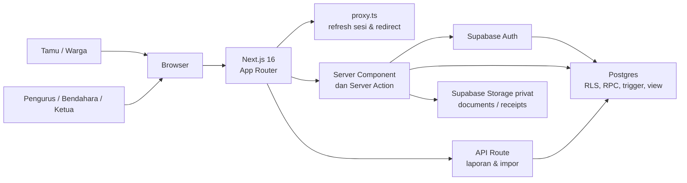
```mermaid
flowchart LR
    W["Tamu / Warga"] --> BR["Browser"]
    P["Pengurus / Bendahara / Ketua"] --> BR

    BR --> NX["Next.js 16<br/>App Router"]
    NX --> PX["proxy.ts<br/>refresh sesi & redirect"]
    NX --> SC["Server Component<br/>dan Server Action"]
    NX --> API["API Route<br/>laporan & impor"]

    SC --> AUTH["Supabase Auth"]
    SC --> DB["Postgres<br/>RLS, RPC, trigger, view"]
    API --> DB

    SC --> ST["Supabase Storage privat<br/>documents / receipts"]
    AUTH --> DB
```

Alur besarnya:

1. **Browser** membuka halaman publik atau halaman internal.
2. **`proxy.ts`** menyegarkan sesi Supabase pada setiap request dan mengarahkan pengguna yang belum login ke `/masuk`.
3. **Server Component** membaca data melalui Supabase client sisi server.
4. **Server Action** menangani perubahan data dari form.
5. **API Route** menangani unduhan laporan, pratinjau impor, dan template impor.
6. **Postgres** menegakkan RLS, trigger, RPC, dan menyediakan view publik.
7. **Storage** menyimpan dokumen dan bukti/nota secara privat.

### 1.5 Peta Halaman Website

#### Halaman publik (tanpa login)

| Rute | Fungsi |
| --- | --- |
| `/` | Beranda: profil singkat, agenda terdekat, ringkasan kas publik |
| `/tentang` | Cerita, nilai, visi, dan misi organisasi |
| `/agenda` | Agenda mendatang dan agenda yang sudah berlangsung |
| `/transparansi` | Saldo, grafik bulanan, rekap kategori, dan rincian transaksi publik |
| `/kontak` | Alamat, telepon/WhatsApp, email, dan media sosial |
| `/masuk` | Halaman login pengurus |
| `/robots.txt`, `/sitemap.xml` | Berkas teknis SEO |

#### Halaman internal (wajib login)

| Rute | Fungsi | Peran yang dapat membuka |
| --- | --- | --- |
| `/dasbor` | Ringkasan saldo, transaksi terbaru, arsip terbaru | Semua pengurus |
| `/arsip` | Daftar dan filter arsip | Semua pengurus |
| `/arsip/unggah` | Unggah dokumen baru | Semua pengurus |
| `/arsip/[id]` | Detail dokumen, versi berkas, unduh, arsipkan/pulihkan | Semua pengurus; arsipkan hanya Ketua |
| `/kas` | Daftar transaksi, filter, saldo | Ketua dan Bendahara |
| `/kas/baru` | Form transaksi baru | Bendahara |
| `/kas/[id]` | Detail transaksi, bukti/nota, ubah visibilitas, arsipkan | Ketua dan Bendahara; aksi tulis hanya Bendahara |
| `/kas/rekap` | Rekap kategori dan bulanan | Ketua dan Bendahara |
| `/kas/kategori` | Kelola kategori transaksi | Ketua dan Bendahara; tulis hanya Bendahara |
| `/kas/impor` | Impor kas lama dari Excel/CSV | Bendahara |
| `/kelola/agenda` | Daftar agenda internal | Semua pengurus |
| `/kelola/agenda/baru` | Tambah agenda | Semua pengurus |
| `/kelola/agenda/[id]` | Edit agenda | Semua pengurus |
| `/pengaturan/publik` | Atur konten halaman publik | Ketua |
| `/aktivitas` | Log aktivitas | Ketua dan Bendahara |
| `/profil` | Profil sendiri; daftar anggota untuk Ketua | Semua pengurus; kelola anggota hanya Ketua |

#### API internal

| Endpoint | Fungsi | Hak akses |
| --- | --- | --- |
| `GET /api/health` | Pemeriksaan kesehatan aplikasi | Publik |
| `POST /api/laporan/import-preview` | Membaca dan memvalidasi berkas impor di server | Ketua dan Bendahara |
| `GET /api/laporan/import-template` | Mengunduh contoh format impor | Ketua dan Bendahara |
| `GET /api/laporan/rekap/pdf` | Mengunduh rekap PDF | Ketua dan Bendahara |
| `GET /api/laporan/rekap/excel` | Mengunduh rekap Excel | Ketua dan Bendahara |

### 1.6 Matriks Hak Akses

| Kemampuan | Tamu | Pengurus | Bendahara | Ketua |
| --- | :---: | :---: | :---: | :---: |
| Melihat halaman publik | Ya | Ya | Ya | Ya |
| Login / logout | - | Ya | Ya | Ya |
| Melihat dasbor | - | Ya | Ya | Ya |
| Memilih periode | - | Ya | Ya | Ya |
| Melihat arsip | - | Ya | Ya | Ya |
| Mengunggah arsip | - | Ya | Ya | Ya |
| Mengunduh arsip | - | Ya | Ya | Ya |
| Mengarsipkan / memulihkan dokumen | - | - | - | Ya |
| Melihat kas dan rekap | - | - | Ya | Ya |
| Menambah / mengubah transaksi | - | - | Ya | - |
| Mengarsipkan / memulihkan transaksi | - | - | Ya | - |
| Mengubah visibilitas publik transaksi | - | - | Ya | - |
| Mengelola kategori transaksi | - | - | Ya | Ya |
| Mengimpor kas lama | - | - | Ya | - |
| Mengunduh rekap PDF/Excel | - | - | Ya | Ya |
| Mengelola agenda | - | Ya | Ya | Ya |
| Melihat log aktivitas | - | - | Ya | Ya |
| Mengatur konten publik | - | - | - | Ya |
| Mengubah peran / status anggota | - | - | - | Ya |
| Mengelola periode | - | - | - | Ya |
| Membuat akun auth baru | - | - | - | - (admin teknis) |

> **Penting:** matriks di atas adalah ringkasan. Aturan final tetap mengikuti RLS pada `supabase/migrations/0003_rls_policies.sql` dan trigger pengaman.

### 1.7 Aturan Bisnis Kunci

| Kode | Aturan | Lokasi implementasi |
| --- | --- | --- |
| BR-01 | Hanya boleh ada satu periode berstatus `active` | Unique partial index `periods_single_active` |
| BR-02 | Periode kerja dipilih pengguna dan disimpan di cookie; fallback ke periode aktif atau terbaru | `getSelectedPeriod()`, `selectPeriod()` |
| BR-03 | Pengeluaran manual wajib punya minimal satu bukti/nota | Zod di server action + constraint trigger deferred |
| BR-04 | Transaksi hasil impor tidak wajib punya nota | Pengecualian `source = 'import'` pada trigger |
| BR-05 | Bukti/nota terakhir tidak boleh dihapus dari pengeluaran aktif | Trigger `guard_attachment_removal` |
| BR-06 | Data operasional tidak dihapus permanen; memakai arsip/pulihkan | `deleted_at`, `status`, tidak ada policy DELETE |
| BR-07 | Hanya Ketua yang boleh mengubah peran atau status aktif akun | Trigger `guard_profile_role_changes` + RLS |
| BR-08 | Hanya Ketua yang boleh mengarsipkan dokumen | Trigger `guard_document_archive` + RLS |
| BR-09 | Hanya Bendahara yang boleh menulis transaksi kas | RLS `transactions_insert_treasurer` dan policy update |
| BR-10 | Ketua dan Bendahara boleh membaca kas; Pengurus tidak | RLS `transactions_select_chairman_treasurer` |
| BR-11 | Transaksi publik hanya yang `is_public = true` dan belum diarsipkan | View `public_transactions`, `public_period_balances` |
| BR-12 | Agenda publik hanya yang `is_public = true` dan bukan `cancelled` | View `public_activities` |
| BR-13 | Maksimal 2.000 baris per impor | Validasi server action impor |
| BR-14 | Berkas maksimal 10 MB; bucket bersifat privat | Konfigurasi bucket dan validasi upload |
| BR-15 | Log audit hanya ditulis oleh trigger; pengguna hanya bisa membaca | Trigger audit dan policy SELECT saja |
| BR-16 | Profil organisasi hanya satu baris dengan `id = 1` | `organization_profiles` check constraint |
| BR-17 | Rekap dihitung dari transaksi aktif, bukan dari saldo manual | `period_balances`, `buildRecapFromEntries` |

---

## 2. Use Case Diagram

### 2.1 Daftar Use Case

| ID | Use Case | Aktor utama | Halaman / aksi | Status |
| --- | --- | --- | --- | --- |
| UC-01 | Melihat beranda | Tamu / Warga | `/` | Ada |
| UC-02 | Melihat profil organisasi | Tamu / Warga | `/tentang` | Ada |
| UC-03 | Melihat agenda publik | Tamu / Warga | `/agenda` | Ada |
| UC-04 | Melihat transparansi kas | Tamu / Warga | `/transparansi` | Ada |
| UC-05 | Memfilter dan mencari transaksi publik | Tamu / Warga | Query `periode`, `jenis`, `kategori`, `q`, `page` | Ada |
| UC-06 | Melihat kontak organisasi | Tamu / Warga | `/kontak` | Ada |
| UC-07 | Membuka halaman login | Tamu | `/masuk` | Ada |
| UC-08 | Masuk ke aplikasi | Pengurus, Bendahara, Ketua | `signIn()` | Ada |
| UC-09 | Keluar dari aplikasi | Pengurus, Bendahara, Ketua | `signOut()` | Ada |
| UC-10 | Menjaga sesi dan hak akses halaman | Sistem | `proxy.ts`, `requireUser()`, `requireRole()` | Ada |
| UC-11 | Melihat dasbor | Semua pengurus | `/dasbor` | Ada |
| UC-12 | Memilih periode kerja | Semua pengurus | `PeriodSwitcher`, cookie | Ada |
| UC-13 | Melihat daftar dan filter arsip | Semua pengurus | `/arsip` | Ada |
| UC-14 | Mengunggah dokumen arsip | Semua pengurus | `/arsip/unggah` | Ada |
| UC-15 | Melihat detail dan mengunduh berkas | Semua pengurus | `/arsip/[id]` | Ada |
| UC-16 | Mengarsipkan / memulihkan dokumen | Ketua | Tombol pada detail dokumen | Ada |
| UC-17 | Melihat daftar transaksi dan saldo | Ketua, Bendahara | `/kas` | Ada |
| UC-18 | Mencatat transaksi kas | Bendahara | `/kas/baru` | Ada |
| UC-19 | Melihat detail transaksi dan bukti | Ketua, Bendahara | `/kas/[id]` | Ada |
| UC-20 | Mengubah visibilitas publik transaksi | Bendahara | Toggle pada detail transaksi | Ada |
| UC-21 | Mengarsipkan / memulihkan transaksi | Bendahara | Tombol pada detail transaksi | Ada |
| UC-22 | Mengelola kategori transaksi | Bendahara, Ketua | `/kas/kategori` | Ada |
| UC-23 | Mengimpor kas lama | Bendahara | `/kas/impor` | Ada |
| UC-24 | Melihat rekapitulasi kas | Ketua, Bendahara | `/kas/rekap` | Ada |
| UC-25 | Mengunduh rekap PDF/Excel | Ketua, Bendahara | `/api/laporan/rekap/*` | Ada |
| UC-26 | Melihat daftar agenda internal | Semua pengurus | `/kelola/agenda` | Ada |
| UC-27 | Menambah agenda | Semua pengurus | `/kelola/agenda/baru` | Ada |
| UC-28 | Mengubah agenda | Semua pengurus | `/kelola/agenda/[id]` | Ada |
| UC-29 | Membatalkan / memulihkan agenda | Semua pengurus | Aksi pada daftar agenda | Ada |
| UC-30 | Mengatur konten halaman publik | Ketua | `/pengaturan/publik` | Ada |
| UC-31 | Melihat log aktivitas | Ketua, Bendahara | `/aktivitas` | Ada |
| UC-32 | Mengubah profil sendiri | Semua pengurus | `/profil` | Ada |
| UC-33 | Mengelola peran anggota | Ketua | `/profil` → daftar anggota | Ada |
| UC-34 | Mengaktifkan / menonaktifkan akun | Ketua | `/profil` → daftar anggota | Ada |
| UC-35 | Mengelola periode kepengurusan | Ketua | `createPeriod()`, `archivePeriod()` | Aksi server tersedia; belum ada halaman UI khusus |
| UC-36 | Membuat akun pengurus baru | Admin teknis | Supabase Dashboard → Authentication → Users | Di luar website |
| UC-37 | Memvalidasi berkas impor | Sistem | `/api/laporan/import-preview` | Ada |
| UC-38 | Menyimpan transaksi dan lampiran secara atomik | Sistem | RPC `create_cash_transaction` | Ada |
| UC-39 | Menyimpan dokumen dan versi secara atomik | Sistem | RPC `create_document_with_version` | Ada |

### 2.2 Relasi Include dan Extend

| Relasi | Jenis | Penjelasan |
| --- | --- | --- |
| UC-05 → UC-04 | `extend` | Filter hanya dijalankan saat pengguna ingin mempersempit daftar transaksi publik |
| UC-23 → UC-37 | `include` | Impor selalu melewati proses validasi berkas di server |
| UC-18 → UC-38 | `include` | Pembuatan transaksi dan lampiran selalu memakai RPC atomik |
| UC-14 → UC-39 | `include` | Pembuatan dokumen dan versi selalu memakai RPC atomik |
| UC-25 → UC-24 | `extend` | Unduhan PDF/Excel merupakan perluasan dari halaman rekap |
| UC-33 → UC-32 | `extend` | Pengelolaan peran adalah kemampuan tambahan Ketua pada area profil |
| UC-34 → UC-32 | `extend` | Pengaktifan/nonaktifan akun adalah kemampuan tambahan Ketua |
| UC-29 → UC-26 | `extend` | Pembatalan/pemulihan agenda dilakukan dari daftar agenda |
| UC-16 → UC-15 | `extend` | Arsip/pulihkan dokumen dilakukan dari halaman detail dokumen |
| UC-20 → UC-19 | `extend` | Toggle publik dilakukan dari detail transaksi |
| UC-21 → UC-19 | `extend` | Arsip/pulihkan transaksi dilakukan dari detail transaksi |

### 2.3 PlantUML Use Case Diagram

Salin kode berikut ke <https://www.plantuml.com/plantuml/uml/> atau ekstensi PlantUML di VS Code.

```plantuml
@startuml
left to right direction
skinparam packageStyle rectangle
skinparam actorStyle awesome
hide stereotype

actor "Tamu / Warga" as Warga
actor "Pengurus" as Pengurus
actor "Bendahara" as Bendahara
actor "Ketua" as Ketua
actor "Admin Teknis\n(Supabase)" as AdminTeknis

' Hak akses diwarisi: Bendahara dan Ketua tetap bisa melakukan use case Pengurus.
Pengurus --|> Warga
Bendahara --|> Pengurus
Ketua --|> Pengurus

rectangle "SIM Karang Taruna Dusun Tagog" {

  package "Halaman Publik" {
    usecase "Melihat beranda" as UC01
    usecase "Melihat profil organisasi" as UC02
    usecase "Melihat agenda publik" as UC03
    usecase "Melihat transparansi kas" as UC04
    usecase "Memfilter dan mencari\ntransaksi publik" as UC05
    usecase "Melihat kontak organisasi" as UC06
    usecase "Membuka halaman login" as UC07
  }

  package "Autentikasi dan Sesi" {
    usecase "Masuk ke aplikasi" as UC08
    usecase "Keluar dari aplikasi" as UC09
    usecase "Menjaga sesi dan\nhak akses halaman" as UC10
  }

  package "Dasbor dan Arsip" {
    usecase "Melihat dasbor" as UC11
    usecase "Memilih periode kerja" as UC12
    usecase "Melihat daftar dan\nfilter arsip" as UC13
    usecase "Mengunggah dokumen arsip" as UC14
    usecase "Melihat detail dan\nmengunduh berkas" as UC15
    usecase "Mengarsipkan / memulihkan\ndokumen" as UC16
  }

  package "Kas dan Laporan" {
    usecase "Melihat daftar transaksi\ndan saldo" as UC17
    usecase "Mencatat transaksi kas" as UC18
    usecase "Melihat detail transaksi\ndan bukti" as UC19
    usecase "Mengubah visibilitas\npublik transaksi" as UC20
    usecase "Mengarsipkan / memulihkan\ntransaksi" as UC21
    usecase "Mengelola kategori transaksi" as UC22
    usecase "Mengimpor kas lama" as UC23
    usecase "Melihat rekapitulasi kas" as UC24
    usecase "Mengunduh rekap PDF/Excel" as UC25
  }

  package "Agenda" {
    usecase "Melihat daftar agenda internal" as UC26
    usecase "Menambah agenda" as UC27
    usecase "Mengubah agenda" as UC28
    usecase "Membatalkan / memulihkan\nagenda" as UC29
  }

  package "Pengaturan dan Administrasi" {
    usecase "Mengatur konten halaman publik" as UC30
    usecase "Melihat log aktivitas" as UC31
    usecase "Mengubah profil sendiri" as UC32
    usecase "Mengelola peran anggota" as UC33
    usecase "Mengaktifkan / menonaktifkan akun" as UC34
    usecase "Mengelola periode kepengurusan" as UC35
    usecase "Membuat akun pengurus baru" as UC36
  }

  package "Layanan Sistem" {
    usecase "Memvalidasi berkas impor" as UC37
    usecase "Menyimpan transaksi dan\nlampiran secara atomik" as UC38
    usecase "Menyimpan dokumen dan\nversi secara atomik" as UC39
  }
}

' Aktor publik
Warga --> UC01
Warga --> UC02
Warga --> UC03
Warga --> UC04
Warga --> UC06
Warga --> UC07
UC05 .> UC04 : <<extend>>

' Autentikasi
Pengurus --> UC08
Pengurus --> UC09

' Dasbor dan arsip
Pengurus --> UC11
Pengurus --> UC12
Pengurus --> UC13
Pengurus --> UC14
Pengurus --> UC15

' Kas: Bendahara menulis, Ketua dan Bendahara membaca
Pengurus --> UC26
Pengurus --> UC27
Pengurus --> UC28
Pengurus --> UC29
Pengurus --> UC32

Bendahara --> UC17
Bendahara --> UC18
Bendahara --> UC19
Bendahara --> UC20
Bendahara --> UC21
Bendahara --> UC22
Bendahara --> UC23
Bendahara --> UC24
Bendahara --> UC25
Bendahara --> UC31

Ketua --> UC16
Ketua --> UC17
Ketua --> UC19
Ketua --> UC22
Ketua --> UC24
Ketua --> UC25
Ketua --> UC30
Ketua --> UC31
Ketua --> UC33
Ketua --> UC34
Ketua --> UC35

AdminTeknis --> UC36

' Relasi include/extend
UC23 .> UC37 : <<include>>
UC18 .> UC38 : <<include>>
UC14 .> UC39 : <<include>>
UC25 .> UC24 : <<extend>>
UC33 .> UC32 : <<extend>>
UC34 .> UC32 : <<extend>>
UC29 .> UC26 : <<extend>>
UC16 .> UC15 : <<extend>>
UC20 .> UC19 : <<extend>>
UC21 .> UC19 : <<extend>>

note bottom of UC10
  Dijalankan otomatis oleh proxy,
  layout aplikasi, dan RLS database.
end note

note bottom of UC35
  Aksi server tersedia,
  tetapi halaman UI khusus
  belum dibuat.
end note

note bottom of UC36
  Di luar website:
  dibuat lewat Supabase Dashboard.
end note

@enduml
```

### 2.4 Skenario Ringkas Use Case Utama

| Use Case | Prasyarat | Alur utama | Alternatif / pengecualian |
| --- | --- | --- | --- |
| UC-08 Masuk | Akun sudah dibuat admin teknis dan aktif | Buka `/masuk` → isi email dan sandi → validasi → Supabase Auth → sesi dibuat → redirect ke `/dasbor` atau `redirectTo` | Kredensial salah → pesan "Email atau sandi salah"; email belum dikonfirmasi → hubungi Ketua; akun nonaktif → dianggap belum login |
| UC-14 Unggah arsip | Login sebagai pengurus; ada periode | Isi judul/kategori/keterangan → pilih 1–5 berkas → unggah ke bucket `documents` → RPC membuat dokumen + versi | Berkas > 10 MB / > 5 berkas / tipe tidak didukung → ditolak; gagal simpan → berkas yang sudah terunggah dihapus |
| UC-18 Catat transaksi | Login sebagai Bendahara; ada periode | Pilih jenis → isi tanggal, nominal, kategori, keterangan → untuk pengeluaran pilih bukti → upload → RPC menyimpan transaksi + lampiran | Pengeluaran tanpa bukti → ditolak; kategori tidak cocok → ditolak; RPC gagal → file bukti dihapus dan pesan error |
| UC-23 Impor kas | Login sebagai Bendahara; ada periode | Unduh template → pilih Excel/CSV → server membaca dan memvalidasi → tampilkan pratinjau → konfirmasi → RPC impor baris valid | Kolom wajib tidak ada / baris invalid → tidak diimpor; > 2.000 baris → ditolak |
| UC-24/25 Rekap & unduh | Login sebagai Ketua/Bendahara; ada periode | Buka `/kas/rekap` → sistem menghitung rekap kategori dan bulanan → klik PDF/Excel → API memeriksa sesi → mengembalikan berkas | Tidak berhak → 401; belum ada periode → 400 |
| UC-20 Visibilitas publik | Login sebagai Bendahara; transaksi ada | Buka detail → klik "Tampil di publik" → `is_public` diubah → halaman publik diperbarui | Gagal update → pesan error; transaksi tetap ada dan tetap dihitung di internal |
| UC-30 Konten publik | Login sebagai Ketua | Buka pengaturan → ubah identitas/tagline/cerita/visi/misi/kontak → simpan → halaman publik diperbarui | Validasi gagal → pesan error; RLS menolak peran lain |
| UC-33/34 Kelola anggota | Login sebagai Ketua | Buka `/profil` → pilih peran atau aktif/nonaktif → simpan → trigger dan RLS memvalidasi | Menurunkan/menonaktifkan diri sendiri → ditolak server |

---

## 3. Flowchart Alur Website dari Awal sampai Selesai

### 3.1 Alur End-to-End: Dari Warga sampai Laporan

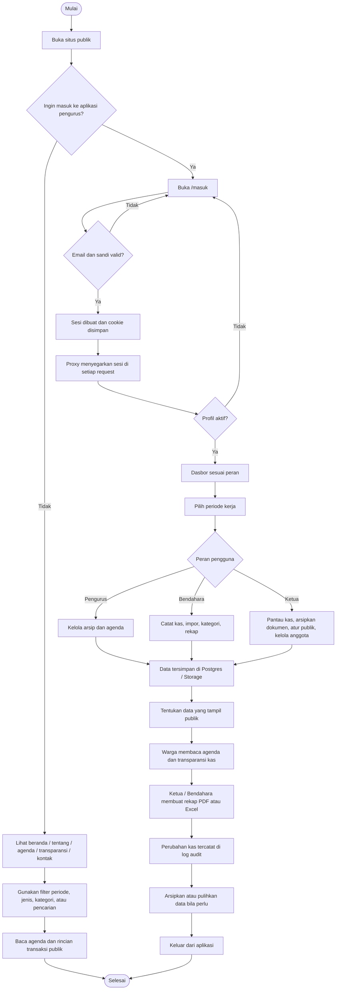
```mermaid
flowchart TD
    A([Mulai]) --> B["Buka situs publik"]
    B --> C{"Ingin masuk ke aplikasi pengurus?"}

    C -->|Tidak| D["Lihat beranda / tentang / agenda / transparansi / kontak"]
    D --> D1["Gunakan filter periode, jenis, kategori, atau pencarian"]
    D1 --> D2["Baca agenda dan rincian transaksi publik"]
    D2 --> Z([Selesai])

    C -->|Ya| E["Buka /masuk"]
    E --> F{"Email dan sandi valid?"}
    F -->|Tidak| E
    F -->|Ya| G["Sesi dibuat dan cookie disimpan"]

    G --> H["Proxy menyegarkan sesi di setiap request"]
    H --> I{"Profil aktif?"}
    I -->|Tidak| E
    I -->|Ya| J["Dasbor sesuai peran"]

    J --> K["Pilih periode kerja"]
    K --> L{"Peran pengguna"}

    L -->|Pengurus| M["Kelola arsip dan agenda"]
    L -->|Bendahara| N["Catat kas, impor, kategori, rekap"]
    L -->|Ketua| O["Pantau kas, arsipkan dokumen, atur publik, kelola anggota"]

    M --> P["Data tersimpan di Postgres / Storage"]
    N --> P
    O --> P

    P --> Q["Tentukan data yang tampil publik"]
    Q --> R["Warga membaca agenda dan transparansi kas"]
    R --> S["Ketua / Bendahara membuat rekap PDF atau Excel"]
    S --> T["Perubahan kas tercatat di log audit"]
    T --> U["Arsipkan atau pulihkan data bila perlu"]
    U --> V["Keluar dari aplikasi"]
    V --> Z
```

### 3.2 Alur Pengunjung Publik

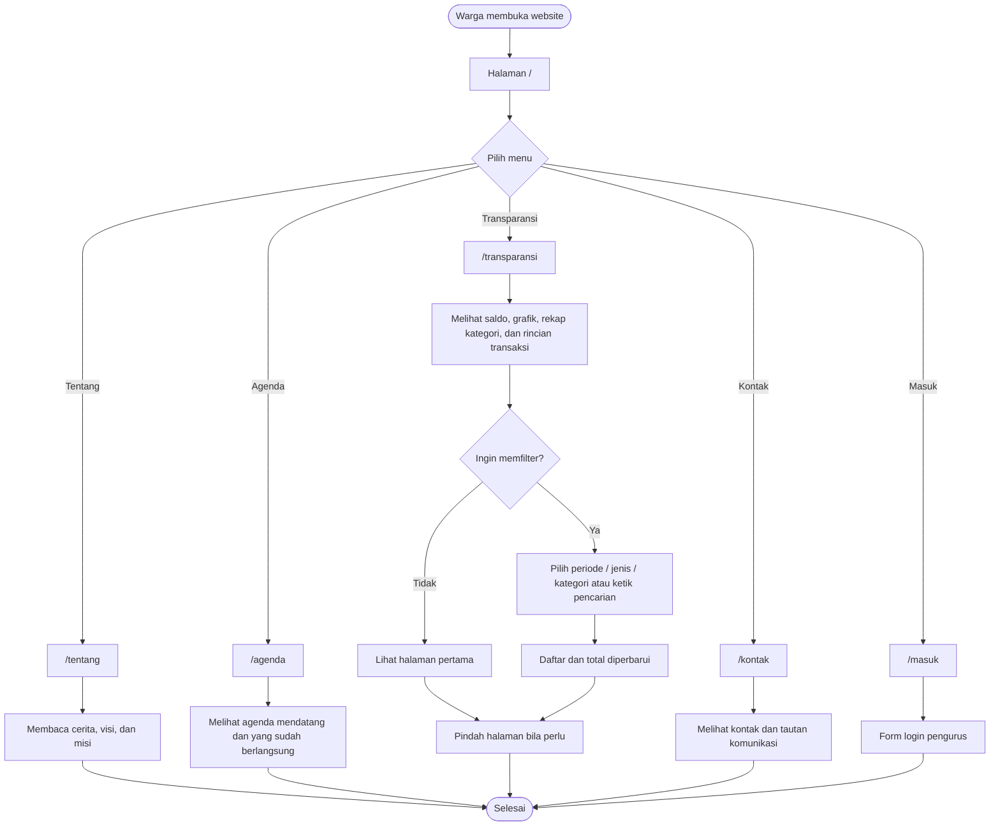
```mermaid
flowchart TD
    A([Warga membuka website]) --> B["Halaman /"]
    B --> C{"Pilih menu"}

    C -->|Tentang| D["/tentang"]
    C -->|Agenda| E["/agenda"]
    C -->|Transparansi| F["/transparansi"]
    C -->|Kontak| G["/kontak"]
    C -->|Masuk| H["/masuk"]

    D --> D1["Membaca cerita, visi, dan misi"]
    E --> E1["Melihat agenda mendatang dan yang sudah berlangsung"]
    F --> F1["Melihat saldo, grafik, rekap kategori, dan rincian transaksi"]
    F1 --> F2{"Ingin memfilter?"}
    F2 -->|Ya| F3["Pilih periode / jenis / kategori atau ketik pencarian"]
    F2 -->|Tidak| F4["Lihat halaman pertama"]
    F3 --> F5["Daftar dan total diperbarui"]
    F4 --> F6["Pindah halaman bila perlu"]
    F5 --> F6
    G --> G1["Melihat kontak dan tautan komunikasi"]
    H --> H1["Form login pengurus"]

    D1 --> Z([Selesai])
    E1 --> Z
    F6 --> Z
    G1 --> Z
    H1 --> Z
```

### 3.3 Alur Pengurus dari Login sampai Logout

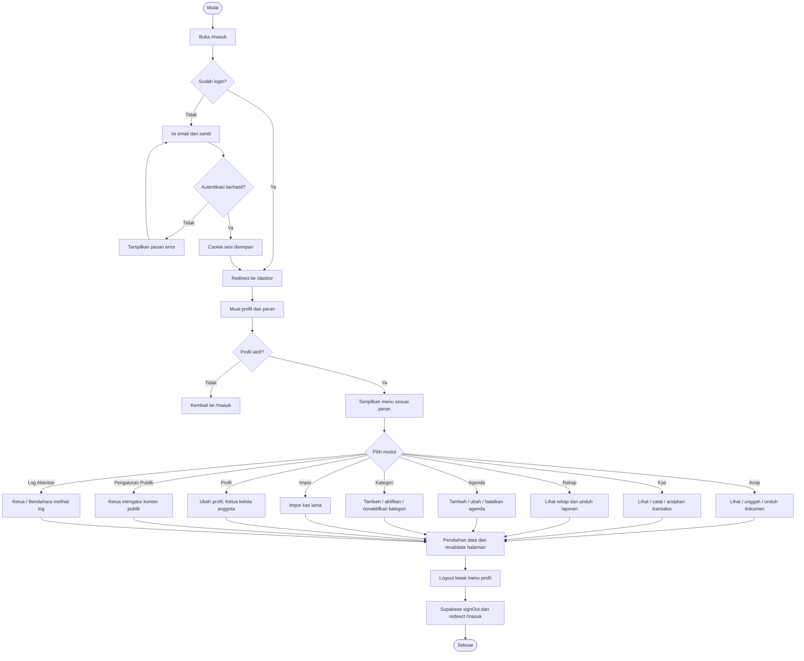
```mermaid
flowchart TD
    A([Mulai]) --> B["Buka /masuk"]
    B --> C{"Sudah login?"}
    C -->|Ya| D["Redirect ke /dasbor"]
    C -->|Tidak| E["Isi email dan sandi"]
    E --> F{"Autentikasi berhasil?"}
    F -->|Tidak| G["Tampilkan pesan error"] --> E
    F -->|Ya| H["Cookie sesi disimpan"]
    H --> D

    D --> I["Muat profil dan peran"]
    I --> J{"Profil aktif?"}
    J -->|Tidak| K["Kembali ke /masuk"]
    J -->|Ya| L["Tampilkan menu sesuai peran"]

    L --> M{"Pilih modul"}
    M -->|Arsip| N["Lihat / unggah / unduh dokumen"]
    M -->|Kas| O["Lihat / catat / arsipkan transaksi"]
    M -->|Rekap| P["Lihat rekap dan unduh laporan"]
    M -->|Agenda| Q["Tambah / ubah / batalkan agenda"]
    M -->|Kategori| R["Tambah / aktifkan / nonaktifkan kategori"]
    M -->|Impor| S["Impor kas lama"]
    M -->|Profil| T["Ubah profil; Ketua kelola anggota"]
    M -->|Pengaturan Publik| U["Ketua mengatur konten publik"]
    M -->|Log Aktivitas| V["Ketua / Bendahara melihat log"]

    N --> W["Perubahan data dan revalidate halaman"]
    O --> W
    P --> W
    Q --> W
    R --> W
    S --> W
    T --> W
    U --> W
    V --> W

    W --> X["Logout lewat menu profil"]
    X --> Y["Supabase signOut dan redirect /masuk"]
    Y --> Z([Selesai])
```

### 3.4 Perpindahan Status Data

#### Transaksi kas

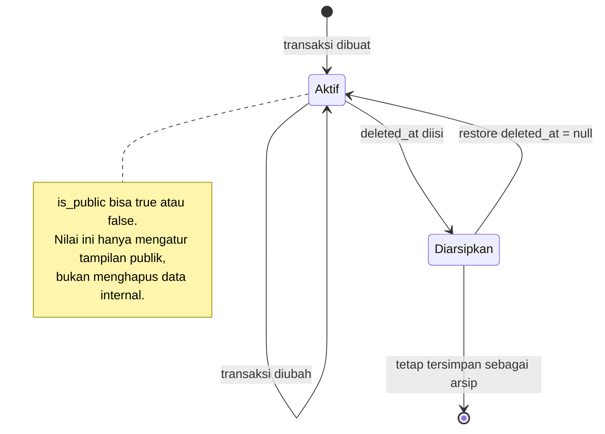
```mermaid
stateDiagram-v2
    [*] --> Aktif: transaksi dibuat
    Aktif --> Aktif: transaksi diubah
    Aktif --> Diarsipkan: deleted_at diisi
    Diarsipkan --> Aktif: restore deleted_at = null
    Diarsipkan --> [*]: tetap tersimpan sebagai arsip

    note right of Aktif
      is_public bisa true atau false.
      Nilai ini hanya mengatur tampilan publik,
      bukan menghapus data internal.
    end note
```

#### Dokumen arsip

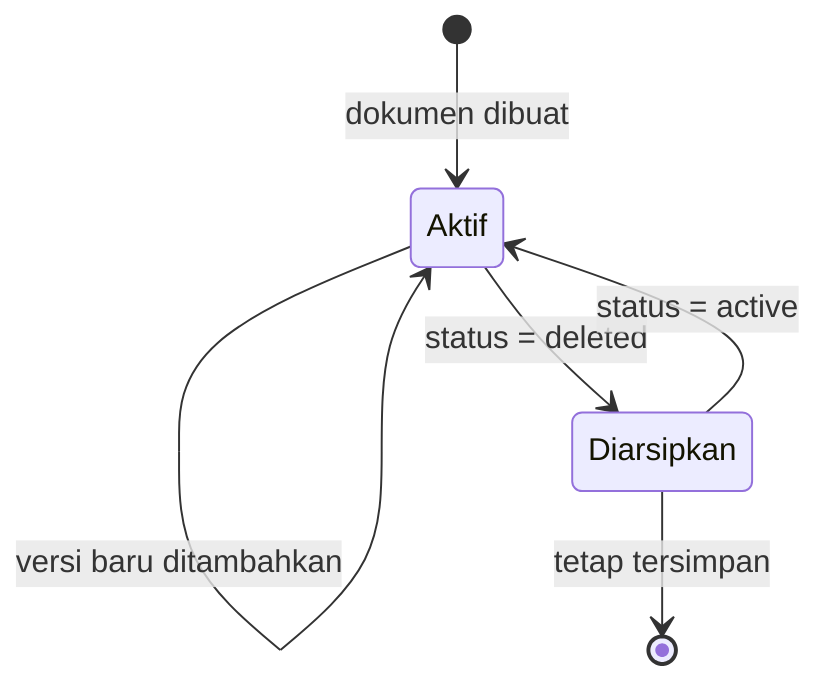
```mermaid
stateDiagram-v2
    [*] --> Aktif: dokumen dibuat
    Aktif --> Aktif: versi baru ditambahkan
    Aktif --> Diarsipkan: status = deleted
    Diarsipkan --> Aktif: status = active
    Diarsipkan --> [*]: tetap tersimpan
```

#### Agenda

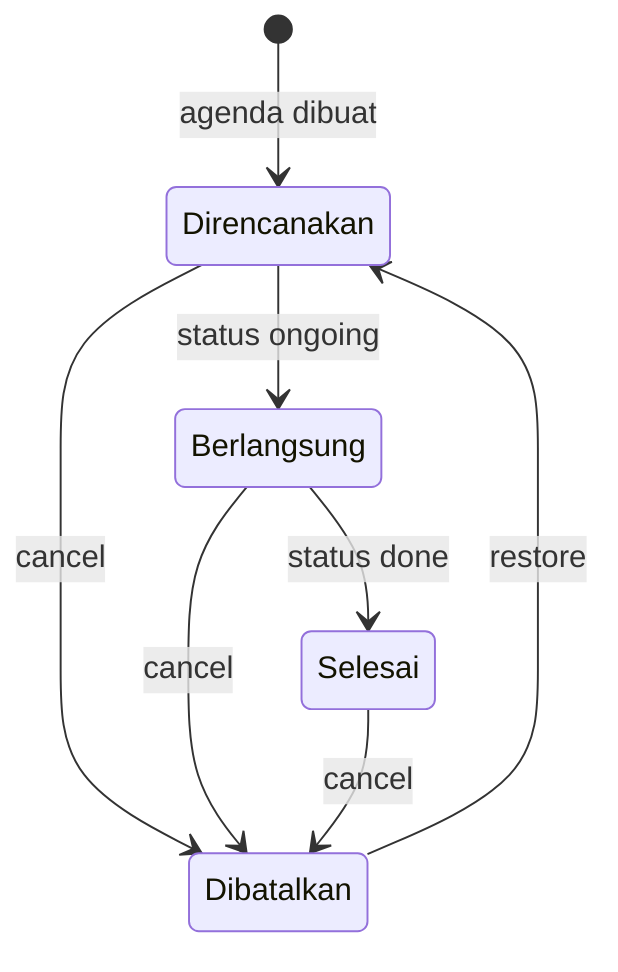
```mermaid
stateDiagram-v2
    [*] --> Direncanakan: agenda dibuat
    Direncanakan --> Berlangsung: status ongoing
    Berlangsung --> Selesai: status done
    Direncanakan --> Dibatalkan: cancel
    Berlangsung --> Dibatalkan: cancel
    Selesai --> Dibatalkan: cancel
    Dibatalkan --> Direncanakan: restore
```

#### Periode kepengurusan

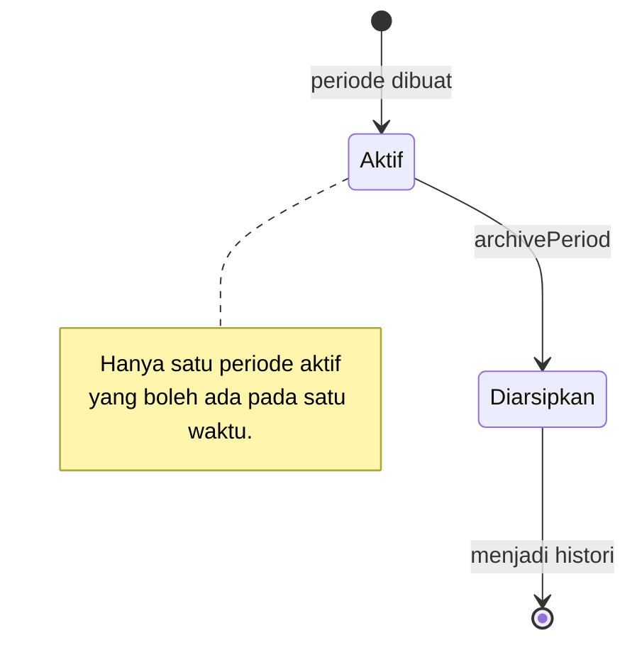
```mermaid
stateDiagram-v2
    [*] --> Aktif: periode dibuat
    Aktif --> Diarsipkan: archivePeriod
    Diarsipkan --> [*]: menjadi histori
    note right of Aktif
      Hanya satu periode aktif
      yang boleh ada pada satu waktu.
    end note
```

---

## 4. Activity Diagram

Activity diagram di bawah memakai **swimlane sederhana** yang direpresentasikan melalui partisipan pada narasi. Untuk gambar formal, gunakan kolom/swimlane:

- **Pengguna**
- **Browser / UI**
- **Next.js (server action / API)**
- **Supabase (Auth / Postgres / Storage)**

### 4.1 AD-01 Login dan Pemeriksaan Sesi

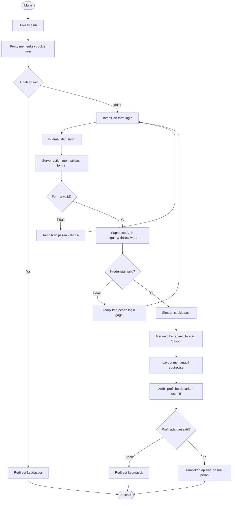
```mermaid
flowchart TD
    A([Mulai]) --> B["Buka /masuk"]
    B --> C["Proxy memeriksa cookie sesi"]
    C --> D{"Sudah login?"}
    D -->|Ya| E["Redirect ke /dasbor"]
    D -->|Tidak| F["Tampilkan form login"]

    F --> G["Isi email dan sandi"]
    G --> H["Server action memvalidasi format"]
    H --> I{"Format valid?"}
    I -->|Tidak| J["Tampilkan pesan validasi"] --> F
    I -->|Ya| K["Supabase Auth signInWithPassword"]
    K --> L{"Kredensial valid?"}
    L -->|Tidak| M["Tampilkan pesan login gagal"] --> F
    L -->|Ya| N["Simpan cookie sesi"]
    N --> O["Redirect ke redirectTo atau /dasbor"]

    O --> P["Layout memanggil requireUser"]
    P --> Q["Ambil profil berdasarkan user id"]
    Q --> R{"Profil ada dan aktif?"}
    R -->|Tidak| S["Redirect ke /masuk"]
    R -->|Ya| T["Tampilkan aplikasi sesuai peran"]
    T --> U([Selesai])
    E --> U
    S --> U
```

### 4.2 AD-02 Melihat Transparansi Kas Publik

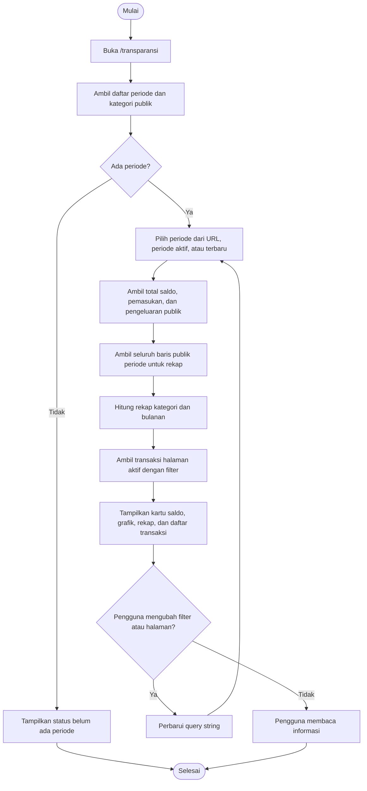
```mermaid
flowchart TD
    A([Mulai]) --> B["Buka /transparansi"]
    B --> C["Ambil daftar periode dan kategori publik"]
    C --> D{"Ada periode?"}
    D -->|Tidak| E["Tampilkan status belum ada periode"] --> Z([Selesai])
    D -->|Ya| F["Pilih periode dari URL, periode aktif, atau terbaru"]
    F --> G["Ambil total saldo, pemasukan, dan pengeluaran publik"]
    G --> H["Ambil seluruh baris publik periode untuk rekap"]
    H --> I["Hitung rekap kategori dan bulanan"]
    I --> J["Ambil transaksi halaman aktif dengan filter"]
    J --> K["Tampilkan kartu saldo, grafik, rekap, dan daftar transaksi"]
    K --> L{"Pengguna mengubah filter atau halaman?"}
    L -->|Ya| M["Perbarui query string"] --> F
    L -->|Tidak| N["Pengguna membaca informasi"]
    N --> Z
```

Catatan: halaman publik **tidak pernah** memakai tabel `cash_transactions` langsung. Data diambil dari view `public_transactions`, `public_period_balances`, `public_periods`, dan `public_transaction_categories`.

### 4.3 AD-03 Mencatat Pemasukan

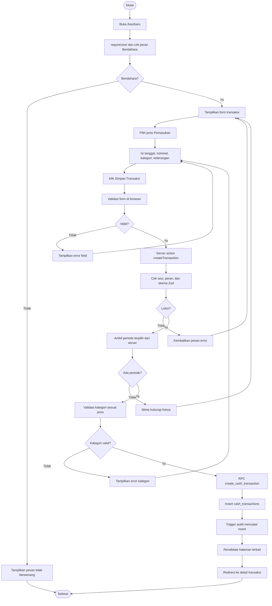
```mermaid
flowchart TD
    A([Mulai]) --> B["Buka /kas/baru"]
    B --> C["requireUser dan cek peran Bendahara"]
    C --> D{"Bendahara?"}
    D -->|Tidak| E["Tampilkan pesan tidak berwenang"] --> Z([Selesai])
    D -->|Ya| F["Tampilkan form transaksi"]
    F --> G["Pilih jenis Pemasukan"]
    G --> H["Isi tanggal, nominal, kategori, keterangan"]
    H --> I["Klik Simpan Transaksi"]
    I --> J["Validasi form di browser"]
    J --> K{"Valid?"}
    K -->|Tidak| L["Tampilkan error field"] --> H
    K -->|Ya| M["Server action createTransaction"]
    M --> N["Cek sesi, peran, dan skema Zod"]
    N --> O{"Lolos?"}
    O -->|Tidak| P["Kembalikan pesan error"] --> F
    O -->|Ya| Q["Ambil periode terpilih dari server"]
    Q --> R{"Ada periode?"}
    R -->|Tidak| S["Minta hubungi Ketua"] --> F
    R -->|Ya| T["Validasi kategori sesuai jenis"]
    T --> U{"Kategori valid?"}
    U -->|Tidak| V["Tampilkan error kategori"] --> H
    U -->|Ya| W["RPC create_cash_transaction"]
    W --> X["Insert cash_transactions"]
    X --> Y["Trigger audit mencatat insert"]
    Y --> AA["Revalidate halaman terkait"]
    AA --> AB["Redirect ke detail transaksi"]
    AB --> Z
```

### 4.4 AD-04 Mencatat Pengeluaran dengan Bukti/Nota

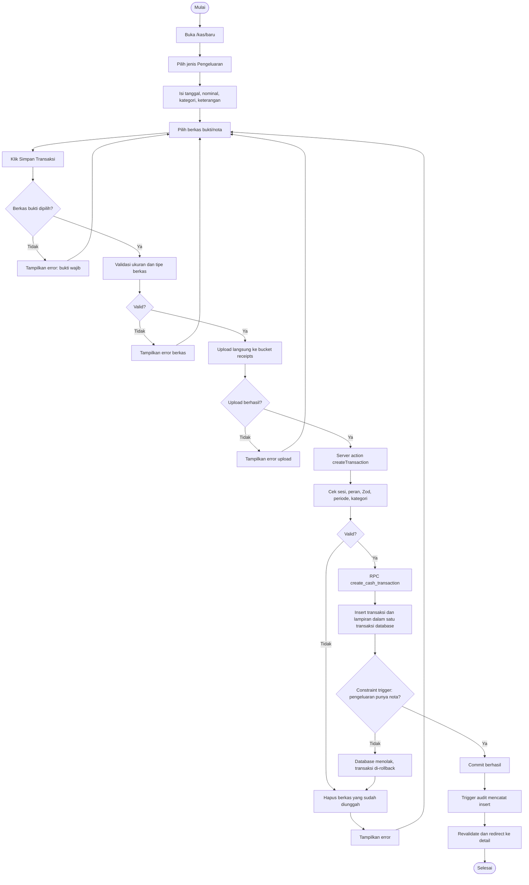
```mermaid
flowchart TD
    A([Mulai]) --> B["Buka /kas/baru"]
    B --> C["Pilih jenis Pengeluaran"]
    C --> D["Isi tanggal, nominal, kategori, keterangan"]
    D --> E["Pilih berkas bukti/nota"]
    E --> F["Klik Simpan Transaksi"]
    F --> G{"Berkas bukti dipilih?"}
    G -->|Tidak| H["Tampilkan error: bukti wajib"] --> E
    G -->|Ya| I["Validasi ukuran dan tipe berkas"]
    I --> J{"Valid?"}
    J -->|Tidak| K["Tampilkan error berkas"] --> E
    J -->|Ya| L["Upload langsung ke bucket receipts"]
    L --> M{"Upload berhasil?"}
    M -->|Tidak| N["Tampilkan error upload"] --> E
    M -->|Ya| O["Server action createTransaction"]
    O --> P["Cek sesi, peran, Zod, periode, kategori"]
    P --> Q{"Valid?"}
    Q -->|Tidak| R["Hapus berkas yang sudah diunggah"] --> S["Tampilkan error"] --> E
    Q -->|Ya| T["RPC create_cash_transaction"]
    T --> U["Insert transaksi dan lampiran dalam satu transaksi database"]
    U --> V{"Constraint trigger: pengeluaran punya nota?"}
    V -->|Tidak| W["Database menolak, transaksi di-rollback"]
    W --> R
    V -->|Ya| X["Commit berhasil"]
    X --> Y["Trigger audit mencatat insert"]
    Y --> Z["Revalidate dan redirect ke detail"]
    Z --> AA([Selesai])
```

### 4.5 AD-05 Impor Kas Lama

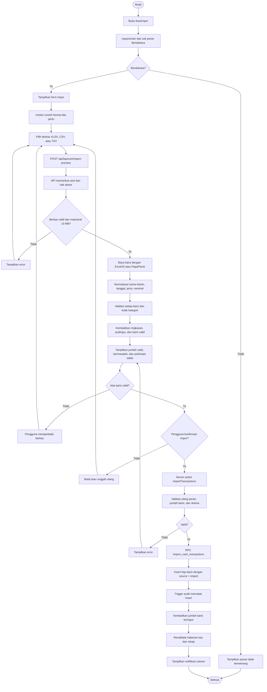
```mermaid
flowchart TD
    A([Mulai]) --> B["Buka /kas/impor"]
    B --> C["requireUser dan cek peran Bendahara"]
    C --> D{"Bendahara?"}
    D -->|Tidak| E["Tampilkan pesan tidak berwenang"] --> Z([Selesai])
    D -->|Ya| F["Tampilkan form impor"]
    F --> G["Unduh contoh format bila perlu"]
    G --> H["Pilih berkas XLSX, CSV, atau TSV"]
    H --> I["POST /api/laporan/import-preview"]
    I --> J["API memeriksa sesi dan hak akses"]
    J --> K{"Berkas valid dan maksimal 10 MB?"}
    K -->|Tidak| L["Tampilkan error"] --> H
    K -->|Ya| M["Baca baris dengan ExcelJS atau PapaParse"]
    M --> N["Normalisasi nama kolom, tanggal, jenis, nominal"]
    N --> O["Validasi setiap baris dan kode kategori"]
    O --> P["Kembalikan ringkasan, pratinjau, dan baris valid"]
    P --> Q["Tampilkan jumlah valid, bermasalah, dan perkiraan saldo"]
    Q --> R{"Ada baris valid?"}
    R -->|Tidak| S["Pengguna memperbaiki berkas"] --> H
    R -->|Ya| T{"Pengguna konfirmasi impor?"}
    T -->|Tidak| U["Batal atau unggah ulang"] --> H
    T -->|Ya| V["Server action importTransactions"]
    V --> W["Validasi ulang peran, jumlah baris, dan skema"]
    W --> X{"Valid?"}
    X -->|Tidak| Y["Tampilkan error"] --> Q
    X -->|Ya| AA["RPC import_cash_transactions"]
    AA --> AB["Insert tiap baris dengan source = import"]
    AB --> AC["Trigger audit mencatat insert"]
    AC --> AD["Kembalikan jumlah baris terimpor"]
    AD --> AE["Revalidate halaman kas dan rekap"]
    AE --> AF["Tampilkan notifikasi sukses"]
    AF --> Z
```

### 4.6 AD-06 Mengunggah Dokumen Arsip

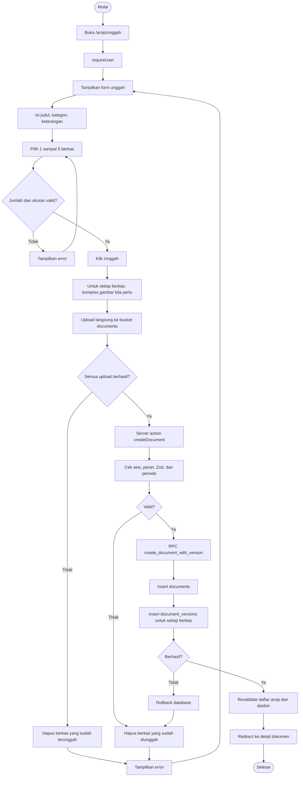
```mermaid
flowchart TD
    A([Mulai]) --> B["Buka /arsip/unggah"]
    B --> C["requireUser"]
    C --> D["Tampilkan form unggah"]
    D --> E["Isi judul, kategori, keterangan"]
    E --> F["Pilih 1 sampai 5 berkas"]
    F --> G{"Jumlah dan ukuran valid?"}
    G -->|Tidak| H["Tampilkan error"] --> F
    G -->|Ya| I["Klik Unggah"]
    I --> J["Untuk setiap berkas: kompres gambar bila perlu"]
    J --> K["Upload langsung ke bucket documents"]
    K --> L{"Semua upload berhasil?"}
    L -->|Tidak| M["Hapus berkas yang sudah terunggah"] --> N["Tampilkan error"] --> D
    L -->|Ya| O["Server action createDocument"]
    O --> P["Cek sesi, peran, Zod, dan periode"]
    P --> Q{"Valid?"}
    Q -->|Tidak| R["Hapus berkas yang sudah diunggah"] --> N
    Q -->|Ya| S["RPC create_document_with_version"]
    S --> T["Insert documents"]
    T --> U["Insert document_versions untuk setiap berkas"]
    U --> V{"Berhasil?"}
    V -->|Tidak| W["Rollback database"] --> R
    V -->|Ya| X["Revalidate daftar arsip dan dasbor"]
    X --> Y["Redirect ke detail dokumen"]
    Y --> Z([Selesai])
```

### 4.7 AD-07 Mengarsipkan atau Memulihkan Dokumen

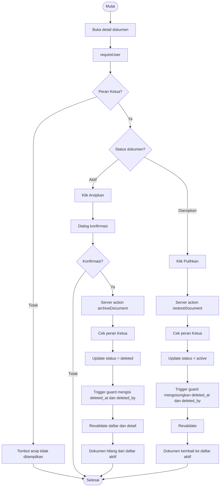
```mermaid
flowchart TD
    A([Mulai]) --> B["Buka detail dokumen"]
    B --> C["requireUser"]
    C --> D{"Peran Ketua?"}
    D -->|Tidak| E["Tombol arsip tidak ditampilkan"] --> Z([Selesai])
    D -->|Ya| F{"Status dokumen?"}
    F -->|Aktif| G["Klik Arsipkan"]
    G --> H["Dialog konfirmasi"]
    H --> I{"Konfirmasi?"}
    I -->|Tidak| Z
    I -->|Ya| J["Server action archiveDocument"]
    J --> K["Cek peran Ketua"]
    K --> L["Update status = deleted"]
    L --> M["Trigger guard mengisi deleted_at dan deleted_by"]
    M --> N["Revalidate daftar dan detail"]
    N --> O["Dokumen hilang dari daftar aktif"]
    O --> Z

    F -->|Diarsipkan| P["Klik Pulihkan"]
    P --> Q["Server action restoreDocument"]
    Q --> R["Cek peran Ketua"]
    R --> S["Update status = active"]
    S --> T["Trigger guard mengosongkan deleted_at dan deleted_by"]
    T --> U["Revalidate"]
    U --> V["Dokumen kembali ke daftar aktif"]
    V --> Z
```

### 4.8 AD-08 Mengelola Agenda

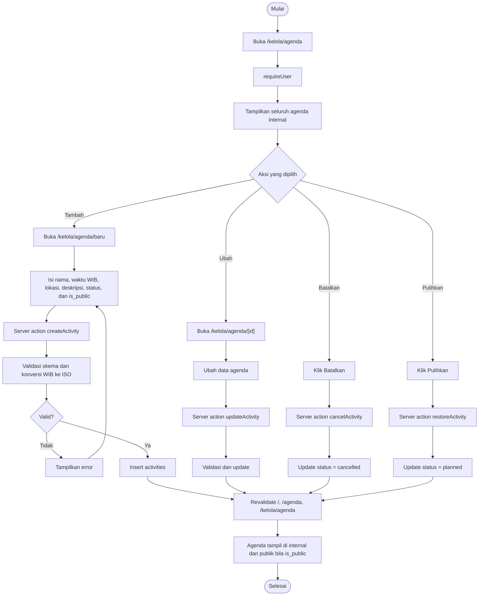
```mermaid
flowchart TD
    A([Mulai]) --> B["Buka /kelola/agenda"]
    B --> C["requireUser"]
    C --> D["Tampilkan seluruh agenda internal"]
    D --> E{"Aksi yang dipilih"}

    E -->|Tambah| F["Buka /kelola/agenda/baru"]
    F --> G["Isi nama, waktu WIB, lokasi, deskripsi, status, dan is_public"]
    G --> H["Server action createActivity"]
    H --> I["Validasi skema dan konversi WIB ke ISO"]
    I --> J{"Valid?"}
    J -->|Tidak| K["Tampilkan error"] --> G
    J -->|Ya| L["Insert activities"]
    L --> M["Revalidate /, /agenda, /kelola/agenda"]
    M --> N["Agenda tampil di internal dan publik bila is_public"]
    N --> Z([Selesai])

    E -->|Ubah| O["Buka /kelola/agenda/[id]"]
    O --> P["Ubah data agenda"]
    P --> Q["Server action updateActivity"]
    Q --> R["Validasi dan update"]
    R --> M

    E -->|Batalkan| S["Klik Batalkan"]
    S --> T["Server action cancelActivity"]
    T --> U["Update status = cancelled"]
    U --> M

    E -->|Pulihkan| V["Klik Pulihkan"]
    V --> W["Server action restoreActivity"]
    W --> X["Update status = planned"]
    X --> M
```

### 4.9 AD-09 Melihat Rekap dan Mengunduh Laporan

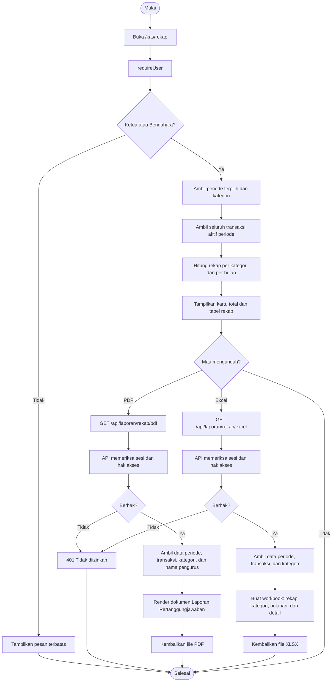
```mermaid
flowchart TD
    A([Mulai]) --> B["Buka /kas/rekap"]
    B --> C["requireUser"]
    C --> D{"Ketua atau Bendahara?"}
    D -->|Tidak| E["Tampilkan pesan terbatas"] --> Z([Selesai])
    D -->|Ya| F["Ambil periode terpilih dan kategori"]
    F --> G["Ambil seluruh transaksi aktif periode"]
    G --> H["Hitung rekap per kategori dan per bulan"]
    H --> I["Tampilkan kartu total dan tabel rekap"]
    I --> J{"Mau mengunduh?"}

    J -->|PDF| K["GET /api/laporan/rekap/pdf"]
    K --> L["API memeriksa sesi dan hak akses"]
    L --> M{"Berhak?"}
    M -->|Tidak| N["401 Tidak diizinkan"] --> Z
    M -->|Ya| O["Ambil data periode, transaksi, kategori, dan nama pengurus"]
    O --> P["Render dokumen Laporan Pertanggungjawaban"]
    P --> Q["Kembalikan file PDF"]
    Q --> Z

    J -->|Excel| R["GET /api/laporan/rekap/excel"]
    R --> S["API memeriksa sesi dan hak akses"]
    S --> T{"Berhak?"}
    T -->|Tidak| N
    T -->|Ya| U["Ambil data periode, transaksi, dan kategori"]
    U --> V["Buat workbook: rekap kategori, bulanan, dan detail"]
    V --> W["Kembalikan file XLSX"]
    W --> Z

    J -->|Tidak| Z
```

### 4.10 AD-10 Mengubah Visibilitas Publik Transaksi

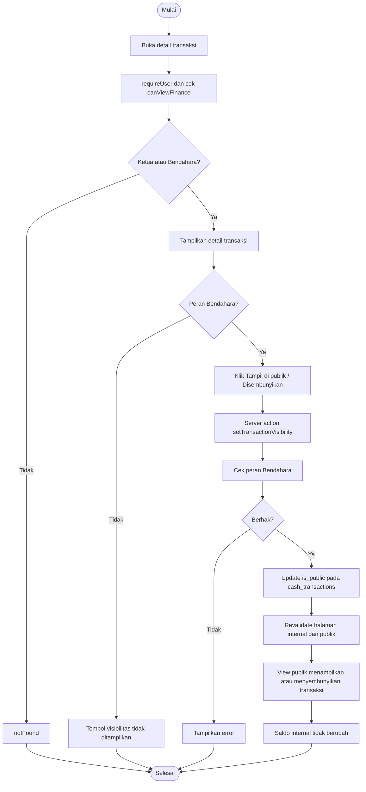
```mermaid
flowchart TD
    A([Mulai]) --> B["Buka detail transaksi"]
    B --> C["requireUser dan cek canViewFinance"]
    C --> D{"Ketua atau Bendahara?"}
    D -->|Tidak| E["notFound"] --> Z([Selesai])
    D -->|Ya| F["Tampilkan detail transaksi"]
    F --> G{"Peran Bendahara?"}
    G -->|Tidak| H["Tombol visibilitas tidak ditampilkan"] --> Z
    G -->|Ya| I["Klik Tampil di publik / Disembunyikan"]
    I --> J["Server action setTransactionVisibility"]
    J --> K["Cek peran Bendahara"]
    K --> L{"Berhak?"}
    L -->|Tidak| M["Tampilkan error"] --> Z
    L -->|Ya| N["Update is_public pada cash_transactions"]
    N --> O["Revalidate halaman internal dan publik"]
    O --> P["View publik menampilkan atau menyembunyikan transaksi"]
    P --> Q["Saldo internal tidak berubah"]
    Q --> Z
```

### 4.11 AD-11 Mengelola Anggota dan Peran

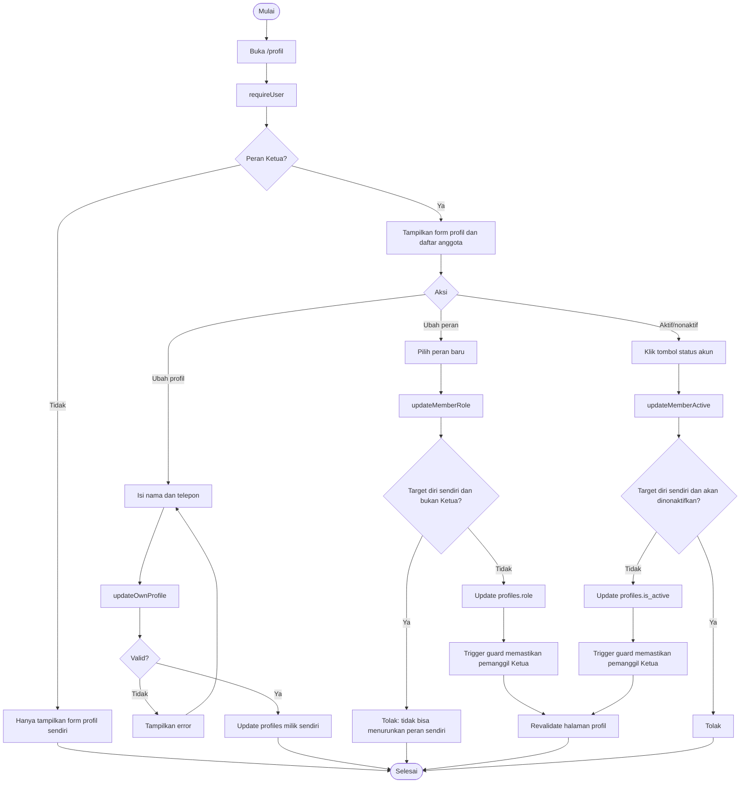
```mermaid
flowchart TD
    A([Mulai]) --> B["Buka /profil"]
    B --> C["requireUser"]
    C --> D{"Peran Ketua?"}
    D -->|Tidak| E["Hanya tampilkan form profil sendiri"] --> Z([Selesai])
    D -->|Ya| F["Tampilkan form profil dan daftar anggota"]
    F --> G{"Aksi"}
    G -->|Ubah profil| H["Isi nama dan telepon"]
    H --> I["updateOwnProfile"]
    I --> J{"Valid?"}
    J -->|Tidak| K["Tampilkan error"] --> H
    J -->|Ya| L["Update profiles milik sendiri"] --> Z

    G -->|Ubah peran| M["Pilih peran baru"]
    M --> N["updateMemberRole"]
    N --> O{"Target diri sendiri dan bukan Ketua?"}
    O -->|Ya| P["Tolak: tidak bisa menurunkan peran sendiri"] --> Z
    O -->|Tidak| Q["Update profiles.role"]
    Q --> R["Trigger guard memastikan pemanggil Ketua"]
    R --> S["Revalidate halaman profil"] --> Z

    G -->|Aktif/nonaktif| T["Klik tombol status akun"]
    T --> U["updateMemberActive"]
    U --> V{"Target diri sendiri dan akan dinonaktifkan?"}
    V -->|Ya| W["Tolak"] --> Z
    V -->|Tidak| X["Update profiles.is_active"]
    X --> Y["Trigger guard memastikan pemanggil Ketua"]
    Y --> S
```

### 4.12 AD-12 Mengelola Kategori Transaksi

```mermaid
flowchart TD
    A([Mulai]) --> B["Buka /kas/kategori"]
    B --> C["requireUser dan canViewFinance"]
    C --> D{"Ketua atau Bendahara?"}
    D -->|Tidak| E["Tampilkan pesan terbatas"] --> Z([Selesai])
    D -->|Ya| F["Tampilkan daftar kategori"]
    F --> G{"Aksi"}
    G -->|Tambah| H["Isi kode, nama, jenis"]
    H --> I["createTransactionCategory"]
    I --> J{"Kode unik dan valid?"}
    J -->|Tidak| K["Tampilkan error"] --> H
    J -->|Ya| L["Insert transaction_categories"] --> Z
    G -->|Nonaktifkan| M["deactivateTransactionCategory"]
    M --> N["Update is_active = false"] --> Z
    G -->|Aktifkan| O["activateTransactionCategory"]
    O --> P["Update is_active = true"] --> Z
```

Catatan: kategori tidak dihapus agar transaksi lama tetap memiliki makna. Kode kategori tidak dapat diubah dari UI.

### 4.13 AD-13 Logout

```mermaid
flowchart TD
    A([Mulai]) --> B["Buka menu profil di kanan atas"]
    B --> C["Klik Keluar"]
    C --> D["Server action signOut"]
    D --> E["Supabase Auth signOut"]
    E --> F["Hapus cookie sesi"]
    F --> G["Redirect ke /masuk"]
    G --> Z([Selesai])
```

---

## 5. Sequence Diagram

Sequence diagram memakai partisipan berikut:

| Partisipan | Peran |
| --- | --- |
| `Pengguna` | Tamu, Pengurus, Bendahara, atau Ketua |
| `Browser` | Antarmuka Next.js di browser |
| `Proxy` | `src/proxy.ts` dan `updateSession()` |
| `UI/Server` | Server Component atau Server Action |
| `Auth` | Supabase Auth |
| `DB` | Postgres + RLS + RPC + trigger |
| `Storage` | Supabase Storage privat |
| `API` | Route handler laporan/impor |

### 5.1 SD-01 Login

```mermaid
sequenceDiagram
    autonumber
    actor U as Pengguna
    participant B as Browser
    participant P as Proxy Next.js
    participant A as Supabase Auth
    participant S as Server Action signIn
    participant D as Postgres
    participant UI as Layout / Halaman

    U->>B: Buka /masuk
    B->>P: GET /masuk
    P->>A: getClaims()
    A-->>P: Status sesi
    alt Sudah login
        P-->>B: Redirect ke /dasbor
    else Belum login
        P-->>B: Lanjutkan request
        B->>UI: Render form login
        U->>B: Isi email dan sandi
        B->>S: submit form
        S->>S: Validasi skema login
        alt Format tidak valid
            S-->>B: Pesan validasi
        else Format valid
            S->>A: signInWithPassword()
            alt Kredensial salah
                A-->>S: Error
                S-->>B: Pesan email/sandi salah
            else Kredensial benar
                A-->>S: Sesi berhasil dibuat
                S-->>B: Set cookie + redirect
                B->>P: GET /dasbor
                P->>A: getClaims()
                A-->>P: Claims user
                P-->>B: Lanjutkan request
                B->>UI: requireUser()
                UI->>D: SELECT profiles WHERE id = user
                D-->>UI: Profil dan peran
                alt Profil tidak aktif
                    UI-->>B: Redirect /masuk
                else Profil aktif
                    UI-->>B: Render dasbor sesuai peran
                end
            end
        end
    end
```

### 5.2 SD-02 Pemeriksaan Sesi pada Halaman Internal

```mermaid
sequenceDiagram
    autonumber
    actor U as Pengguna
    participant B as Browser
    participant P as Proxy
    participant A as Supabase Auth
    participant L as Layout Aplikasi
    participant H as Halaman
    participant D as Postgres

    U->>B: Buka /kas
    B->>P: GET /kas
    P->>A: getClaims()
    alt Tidak ada sesi
        A-->>P: Tidak ada claims
        P-->>B: Redirect /masuk?redirectTo=/kas
    else Ada sesi
        A-->>P: Claims valid
        P-->>B: Response + cookie sesi diperbarui
        B->>L: Render layout
        L->>D: SELECT profiles
        alt Profil tidak aktif
            L-->>B: Redirect /masuk
        else Profil aktif
            L-->>B: Tampilkan shell aplikasi
            B->>H: Render halaman /kas
            H->>H: requireUser() dan canViewFinance()
            alt Tidak berhak
                H-->>B: Pesan terbatas
            else Berhak
                H->>D: Query transaksi, kategori, saldo
                D-->>H: Data
                H-->>B: Render daftar kas
            end
        end
    end
```

### 5.3 SD-03 Mencatat Pengeluaran dengan Bukti

```mermaid
sequenceDiagram
    autonumber
    actor U as Bendahara
    participant B as Browser
    participant ST as Supabase Storage
    participant SA as Server Action
    participant D as Postgres
    participant DB as RPC create_cash_transaction

    U->>B: Buka /kas/baru dan isi form pengeluaran
    U->>B: Pilih berkas bukti/nota
    B->>B: Validasi ukuran, tipe, dan keberadaan bukti
    alt Bukti tidak ada atau tidak valid
        B-->>U: Tampilkan error
    else Valid
        B->>ST: Upload ke bucket receipts
        ST-->>B: storage_path, nama, ukuran, mime
        B->>SA: createTransaction(data + attachments)
        SA->>SA: requireUser, canManageFinance, Zod
        alt Tidak berhak atau data tidak valid
            SA-->>B: Pesan error
            B->>ST: Hapus berkas yang sudah diunggah
            B-->>U: Tampilkan error
        else Valid
            SA->>D: getSelectedPeriod()
            D-->>SA: Periode terpilih
            SA->>D: Validasi kategori
            D-->>SA: Kategori valid
            SA->>DB: create_cash_transaction(...)
            DB->>D: INSERT cash_transactions
            DB->>D: INSERT transaction_attachments
            D->>D: Constraint trigger cek nota saat COMMIT
            alt Pengeluaran tanpa nota
                D-->>DB: Exception 23514
                DB-->>SA: Error
                SA-->>B: Pesan bukti wajib
                B->>ST: Hapus berkas
                B-->>U: Tampilkan error
            else Nota ada
                D->>D: Trigger audit mencatat insert
                D-->>DB: COMMIT
                DB-->>SA: UUID transaksi
                SA->>SA: revalidatePath halaman terkait
                SA-->>B: ok + id
                B-->>U: Redirect ke /kas/[id]
            end
        end
    end
```

### 5.4 SD-04 Mengunggah Dokumen Arsip

```mermaid
sequenceDiagram
    autonumber
    actor U as Pengurus
    participant B as Browser
    participant ST as Supabase Storage
    participant SA as Server Action
    participant D as Postgres
    participant DB as RPC create_document_with_version

    U->>B: Buka /arsip/unggah
    U->>B: Isi judul, kategori, keterangan
    U->>B: Pilih 1-5 berkas
    B->>B: Validasi jumlah dan ukuran
    alt Tidak valid
        B-->>U: Tampilkan error
    else Valid
        loop Setiap berkas
            B->>B: Kompres gambar bila perlu
            B->>ST: Upload ke bucket documents
            ST-->>B: Metadata berkas
        end
        B->>SA: createDocument(judul, kategori, versions)
        SA->>SA: requireUser, canUploadDocuments, Zod
        alt Tidak berhak atau data tidak valid
            SA-->>B: Error
            B->>ST: Hapus berkas yang sudah diunggah
            B-->>U: Tampilkan error
        else Valid
            SA->>D: getSelectedPeriod()
            D-->>SA: Periode
            SA->>DB: create_document_with_version(...)
            DB->>D: INSERT documents
            DB->>D: INSERT document_versions
            D-->>DB: COMMIT
            DB-->>SA: UUID dokumen
            SA->>SA: revalidatePath /arsip dan /dasbor
            SA-->>B: ok + id
            B-->>U: Redirect ke /arsip/[id]
        end
    end
```

### 5.5 SD-05 Impor Kas Lama

```mermaid
sequenceDiagram
    autonumber
    actor U as Bendahara
    participant B as Browser
    participant API as API import-preview
    participant SA as Server Action import
    participant D as Postgres
    participant DB as RPC import_cash_transactions

    U->>B: Buka /kas/impor
    U->>B: Pilih berkas XLSX/CSV/TSV
    B->>API: POST multipart file
    API->>API: Cek sesi dan canViewFinance
    alt Tidak berhak
        API-->>B: 401 Tidak diizinkan
    else Berhak
        API->>API: Validasi ukuran dan ekstensi
        API->>API: Baca baris dengan ExcelJS/PapaParse
        API->>D: Ambil kode kategori
        D-->>API: Daftar kategori
        API->>API: parseImportRows dan validasi baris
        API-->>B: summary + preview + validRows
        B-->>U: Tampilkan pratinjau dan jumlah valid/bermasalah
        U->>B: Klik Impor X transaksi
        B->>SA: importTransactions(validRows)
        SA->>SA: Cek peran Bendahara, jumlah maksimal 2000, Zod
        alt Tidak valid
            SA-->>B: Pesan error
            B-->>U: Tampilkan error
        else Valid
            SA->>D: getSelectedPeriod()
            D-->>SA: Periode
            SA->>DB: import_cash_transactions(period, rows)
            loop Setiap baris
                DB->>D: INSERT cash_transactions source=import
            end
            D->>D: Trigger audit mencatat insert
            D-->>DB: COMMIT
            DB-->>SA: Jumlah baris terimpor
            SA->>SA: revalidatePath /kas, /dasbor, /kas/rekap
            SA-->>B: ok + jumlah
            B-->>U: Notifikasi sukses
        end
    end
```

### 5.6 SD-06 Halaman Transparansi Publik

```mermaid
sequenceDiagram
    autonumber
    actor W as Warga
    participant B as Browser
    participant P as Proxy
    participant H as Halaman /transparansi
    participant D as Postgres

    W->>B: Buka /transparansi
    B->>P: GET /transparansi
    P->>P: getClaims, route publik, lanjutkan tanpa login
    P-->>B: Response
    B->>H: Render halaman
    H->>D: SELECT public_periods
    H->>D: SELECT public_transaction_categories
    D-->>H: Data periode dan kategori
    alt Tidak ada periode
        H-->>B: Tampilkan status belum ada periode
    else Ada periode
        H->>D: SELECT public_period_balances
        H->>D: SELECT public_transactions untuk rekap
        H->>D: SELECT count public_transactions dengan filter
        D-->>H: Total, rekap, jumlah
        H->>D: SELECT public_transactions halaman aktif
        D-->>H: Daftar transaksi
        H-->>B: Render kartu saldo, grafik, rekap, daftar
        W->>B: Ubah filter atau halaman
        B->>H: GET /transparansi?periode=...&jenis=...&kategori=...&q=...
        H->>D: Query ulang dengan filter
        D-->>H: Data baru
        H-->>B: Render hasil filter
    end
```

### 5.7 SD-07 Unduh Rekap PDF/Excel

```mermaid
sequenceDiagram
    autonumber
    actor U as Ketua / Bendahara
    participant B as Browser
    participant API as API rekap
    participant A as Supabase Auth
    participant D as Postgres
    participant R as Report Generator

    U->>B: Klik tombol PDF atau Excel di /kas/rekap
    B->>API: GET /api/laporan/rekap/pdf atau /excel
    API->>A: getCurrentUser()
    A-->>API: User dan profil
    alt Tidak login atau bukan Ketua/Bendahara
        API-->>B: 401 Tidak diizinkan
    else Berhak
        API->>D: getSelectedPeriod()
        alt Tidak ada periode
            API-->>B: 400 Belum ada periode
        else Ada periode
            par Ambil data
                API->>D: SELECT cash_transactions aktif
                API->>D: SELECT transaction_categories
                API->>D: SELECT organization_profiles
            end
            D-->>API: Data lengkap
            API->>R: buildRecap / buildRecapWorkbook / renderLpj
            R-->>API: Buffer PDF atau XLSX
            API-->>B: File dengan Content-Disposition attachment
            B-->>U: Unduhan dimulai
        end
    end
```

### 5.8 SD-08 Mengubah Visibilitas Publik Transaksi

```mermaid
sequenceDiagram
    autonumber
    actor U as Bendahara
    participant B as Browser
    participant SA as Server Action
    participant D as Postgres

    U->>B: Buka /kas/[id]
    B->>D: Ambil transaksi dan lampiran
    D-->>B: Data transaksi
    U->>B: Klik Toggle Tampil di publik
    B->>SA: setTransactionVisibility(id, next)
    SA->>SA: requireUser dan canManageFinance
    alt Bukan Bendahara
        SA-->>B: Error tidak berwenang
    else Bendahara
        SA->>D: UPDATE cash_transactions SET is_public = next
        D->>D: Trigger audit mencatat update
        D-->>SA: Sukses
        SA->>SA: revalidatePath /kas, /kas/[id], /, /transparansi
        SA-->>B: ok
        B-->>U: Notifikasi dan status tombol berubah
        Note over D: View publik otomatis mengikuti is_public
    end
```

### 5.9 SD-09 Membuat Agenda dan Publikasi

```mermaid
sequenceDiagram
    autonumber
    actor U as Pengurus
    participant B as Browser
    participant SA as Server Action
    participant D as Postgres

    U->>B: Buka /kelola/agenda/baru
    U->>B: Isi nama, waktu WIB, lokasi, status, is_public
    B->>SA: createActivity(values)
    SA->>SA: requireUser dan validasi activityFormSchema
    alt Tidak valid
        SA-->>B: Pesan error
        B-->>U: Tampilkan error
    else Valid
        SA->>SA: Konversi waktu WIB ke ISO
        SA->>D: INSERT activities
        D-->>SA: id agenda
        SA->>SA: revalidatePath /, /agenda, /kelola/agenda
        SA-->>B: ok + id
        B-->>U: Redirect ke daftar agenda
        Note over D: View public_activities hanya menampilkan is_public = true dan status bukan cancelled
    end
```

### 5.10 SD-10 Mengubah Peran Anggota

```mermaid
sequenceDiagram
    autonumber
    actor K as Ketua
    participant B as Browser
    participant SA as Server Action
    participant D as Postgres
    participant T as Trigger guard

    K->>B: Buka /profil dan daftar anggota
    K->>B: Pilih peran baru
    B->>SA: updateMemberRole(userId, role)
    SA->>SA: requireUser dan cek peran Ketua
    alt Bukan Ketua
        SA-->>B: Error tidak berwenang
    else Ketua
        SA->>SA: Cek target bukan diri sendiri untuk penurunan peran
        alt Target diri sendiri dan role bukan chairman
            SA-->>B: Error tidak bisa menurunkan diri sendiri
        else Boleh
            SA->>D: UPDATE profiles SET role = ...
            D->>T: BEFORE UPDATE guard_profile_role_changes
            T->>T: Cek is_chairman()
            alt Pemanggil bukan Ketua
                T-->>D: Exception 42501
                D-->>SA: Error
                SA-->>B: Pesan error
            else Pemanggil Ketua
                T-->>D: Lanjutkan
                D-->>SA: Sukses
                SA->>SA: revalidatePath /profil
                SA-->>B: ok
                B-->>K: Peran diperbarui
            end
        end
    end
```

### 5.11 SD-11 Arsipkan / Pulihkan Transaksi

```mermaid
sequenceDiagram
    autonumber
    actor U as Bendahara
    participant B as Browser
    participant SA as Server Action
    participant D as Postgres

    U->>B: Buka detail transaksi
    U->>B: Klik Arsipkan atau Pulihkan
    B->>SA: archiveTransaction(id) atau restoreTransaction(id)
    SA->>SA: requireUser dan canManageFinance
    alt Bukan Bendahara
        SA-->>B: Error tidak berwenang
    else Bendahara
        SA->>D: UPDATE deleted_at dan deleted_by
        D->>D: Trigger audit mencatat delete/restore
        D-->>SA: Sukses
        SA->>SA: revalidatePath halaman terkait
        SA-->>B: ok
        B-->>U: Notifikasi dan status berubah
        Note over D: Saldo periode otomatis mengecualikan deleted_at
    end
```

---

## 6. ERD dan Rancangan Database

### 6.1 Gambaran Umum Database

Database memakai **PostgreSQL** di Supabase, dengan skema publik `public` dan skema autentikasi `auth`.

Prinsip rancangan:

1. **UUID** sebagai primary key untuk tabel transaksional.
2. **Soft delete** untuk data yang harus tetap dapat diaudit.
3. **Foreign key** untuk menjaga integritas relasi utama.
4. **Enum** untuk nilai yang terbatas dan konsisten.
5. **View publik** untuk membatasi kolom yang dapat dibaca anonim.
6. **RLS** untuk membatasi baris yang dapat dibaca/ditulis.
7. **Trigger** untuk aturan bisnis yang tidak boleh dilewati aplikasi.
8. **RPC** untuk operasi multi-tabel yang harus atomik.

### 6.2 ERD Mermaid

```mermaid
erDiagram
    AUTH_USERS ||--|| PROFILES : "id"
    PROFILES ||--o{ PERIODS : "closed_by"
    PROFILES ||--o{ DOCUMENTS : "uploaded_by"
    PROFILES ||--o{ DOCUMENTS : "deleted_by"
    PROFILES ||--o{ DOCUMENT_VERSIONS : "uploaded_by"
    PROFILES ||--o{ CASH_TRANSACTIONS : "created_by"
    PROFILES ||--o{ CASH_TRANSACTIONS : "deleted_by"
    PROFILES ||--o{ TRANSACTION_ATTACHMENTS : "uploaded_by"
    PROFILES ||--o{ ACTIVITIES : "created_by"
    PROFILES ||..o{ CASH_TRANSACTIONS : "member_id tanpa FK"

    PERIODS ||--o{ DOCUMENTS : "period_id"
    PERIODS ||--o{ CASH_TRANSACTIONS : "period_id"

    DOCUMENT_CATEGORIES ||--o{ DOCUMENTS : "category_id"
    TRANSACTION_CATEGORIES ||--o{ CASH_TRANSACTIONS : "category_id"

    DOCUMENTS ||--o{ DOCUMENT_VERSIONS : "document_id"
    CASH_TRANSACTIONS ||--o{ TRANSACTION_ATTACHMENTS : "transaction_id"
    CASH_TRANSACTIONS ||..o{ AUDIT_LOGS : "record_id logis"

    AUTH_USERS {
        uuid id PK
        text email
        timestamptz created_at
    }

    PROFILES {
        uuid id PK
        text full_name
        app_role role
        text phone
        boolean is_active
        timestamptz created_at
        timestamptz updated_at
    }

    PERIODS {
        uuid id PK
        text name
        integer start_year
        integer end_year
        period_status status
        bigint dues_amount
        timestamptz closed_at
        uuid closed_by FK
        timestamptz created_at
        timestamptz updated_at
    }

    ORGANIZATION_PROFILES {
        smallint id PK
        text org_name
        text dusun_name
        text address
        text logo_path
        text tagline
        text about_text
        text vision
        text mission
        text contact_phone
        text contact_email
        text instagram_url
        text facebook_url
        text maps_url
        timestamptz updated_at
    }

    DOCUMENT_CATEGORIES {
        uuid id PK
        text code UK
        text label
        boolean is_active
        integer sort_order
        timestamptz created_at
    }

    TRANSACTION_CATEGORIES {
        uuid id PK
        text code UK
        text label
        category_kind kind
        boolean is_active
        integer sort_order
        timestamptz created_at
        timestamptz updated_at
    }

    DOCUMENTS {
        uuid id PK
        uuid period_id FK
        text title
        text description
        uuid category_id FK
        integer year
        uuid uploaded_by FK
        integer current_version
        document_status status
        timestamptz deleted_at
        uuid deleted_by FK
        timestamptz created_at
        timestamptz updated_at
    }

    DOCUMENT_VERSIONS {
        uuid id PK
        uuid document_id FK
        integer version_no
        text storage_path
        text file_name
        integer file_size
        text mime_type
        text note
        uuid uploaded_by FK
        timestamptz uploaded_at
    }

    CASH_TRANSACTIONS {
        uuid id PK
        uuid period_id FK
        date transaction_date
        transaction_kind kind
        bigint amount
        uuid category_id FK
        uuid member_id
        text description
        transaction_source source
        boolean is_public
        uuid created_by FK
        timestamptz created_at
        timestamptz updated_at
        timestamptz deleted_at
        uuid deleted_by FK
    }

    TRANSACTION_ATTACHMENTS {
        uuid id PK
        uuid transaction_id FK
        text storage_path
        text file_name
        integer file_size
        text mime_type
        uuid uploaded_by FK
        timestamptz created_at
    }

    AUDIT_LOGS {
        bigint id PK
        text table_name
        uuid record_id
        text action
        uuid actor_id
        text actor_role
        jsonb old_data
        jsonb new_data
        timestamptz created_at
    }

    ACTIVITIES {
        uuid id PK
        text title
        text description
        text location
        timestamptz starts_at
        timestamptz ends_at
        activity_status status
        boolean is_public
        uuid created_by FK
        timestamptz created_at
        timestamptz updated_at
    }
```

### 6.3 Kamus Entitas

#### 1. `auth.users` (skema Supabase Auth)

| Kolom | Tipe | Kunci | Keterangan |
| --- | --- | --- | --- |
| `id` | `uuid` | PK | ID pengguna auth; menjadi rujukan `profiles.id` |
| `email` | `text` |  | Email login |
| `created_at` | `timestamptz` |  | Waktu akun dibuat |

Tabel ini dikelola Supabase Auth. Aplikasi tidak menulis langsung ke tabel ini.

#### 2. `profiles`

| Kolom | Tipe | Kunci / Aturan | Keterangan |
| --- | --- | --- | --- |
| `id` | `uuid` | PK, FK → `auth.users.id`, cascade | Sama dengan ID auth |
| `full_name` | `text` | not null, default `''` | Nama lengkap |
| `role` | `app_role` | not null, default `manager` | `chairman`, `treasurer`, `manager` |
| `phone` | `text` | nullable | Nomor telepon |
| `is_active` | `boolean` | not null, default `true` | Akun nonaktif dianggap tidak login |
| `created_at` | `timestamptz` | not null | Waktu dibuat |
| `updated_at` | `timestamptz` | not null | Diperbarui trigger |

Catatan: profil dibuat otomatis oleh trigger `handle_new_user()` saat akun auth baru dibuat. Peran awal `manager`.

#### 3. `periods`

| Kolom | Tipe | Kunci / Aturan | Keterangan |
| --- | --- | --- | --- |
| `id` | `uuid` | PK | ID periode |
| `name` | `text` | not null | Nama periode, mis. "Periode 2025-2026" |
| `start_year` | `integer` | not null | Tahun mulai |
| `end_year` | `integer` | not null, >= `start_year` | Tahun selesai |
| `status` | `period_status` | not null, default `active` | `active` atau `archived` |
| `dues_amount` | `bigint` | nullable, >= 0 | Nominal iuran (disiapkan) |
| `closed_at` | `timestamptz` | nullable | Waktu diarsipkan |
| `closed_by` | `uuid` | FK → `profiles.id`, set null | Ketua yang mengarsipkan |
| `created_at` | `timestamptz` | not null | Waktu dibuat |
| `updated_at` | `timestamptz` | not null | Diperbarui trigger |

Indeks penting: `periods_single_active` memastikan hanya satu baris `status = 'active'`.

#### 4. `organization_profiles`

| Kolom | Tipe | Kunci / Aturan | Keterangan |
| --- | --- | --- | --- |
| `id` | `smallint` | PK, check `id = 1` | Baris tunggal |
| `org_name` | `text` | not null | Nama organisasi |
| `dusun_name` | `text` | not null | Nama dusun |
| `address` | `text` | nullable | Alamat |
| `logo_path` | `text` | nullable | Path logo |
| `tagline` | `text` | nullable | Tagline beranda |
| `about_text` | `text` | nullable | Cerita halaman Tentang |
| `vision` | `text` | nullable | Visi |
| `mission` | `text` | nullable | Misi, satu poin per baris |
| `contact_phone` | `text` | nullable | Telepon/WhatsApp |
| `contact_email` | `text` | nullable | Email |
| `instagram_url` | `text` | nullable | Tautan Instagram |
| `facebook_url` | `text` | nullable | Tautan Facebook |
| `maps_url` | `text` | nullable | Tautan peta |
| `updated_at` | `timestamptz` | not null | Waktu diperbarui |

Tabel ini dapat dibaca publik dan hanya dapat diubah Ketua.

#### 5. `document_categories`

| Kolom | Tipe | Kunci / Aturan | Keterangan |
| --- | --- | --- | --- |
| `id` | `uuid` | PK | ID kategori |
| `code` | `text` | unique, not null | Kode kategori, mis. `proposal` |
| `label` | `text` | not null | Nama tampilan |
| `is_active` | `boolean` | not null, default `true` | Status aktif |
| `sort_order` | `integer` | not null, default 0 | Urutan tampilan |
| `created_at` | `timestamptz` | not null | Waktu dibuat |

#### 6. `transaction_categories`

| Kolom | Tipe | Kunci / Aturan | Keterangan |
| --- | --- | --- | --- |
| `id` | `uuid` | PK | ID kategori |
| `code` | `text` | unique, not null | Kode kategori, mis. `iuran` |
| `label` | `text` | not null | Nama tampilan |
| `kind` | `category_kind` | not null, default `both` | `income`, `expense`, atau `both` |
| `is_active` | `boolean` | not null, default `true` | Kategori nonaktif tidak dipakai form |
| `sort_order` | `integer` | not null, default 0 | Urutan tampilan |
| `created_at` | `timestamptz` | not null | Waktu dibuat |
| `updated_at` | `timestamptz` | not null | Diperbarui trigger |

#### 7. `documents`

| Kolom | Tipe | Kunci / Aturan | Keterangan |
| --- | --- | --- | --- |
| `id` | `uuid` | PK | ID dokumen |
| `period_id` | `uuid` | FK → `periods.id`, restrict | Periode dokumen |
| `title` | `text` | not null | Judul dokumen |
| `description` | `text` | nullable | Keterangan |
| `category_id` | `uuid` | FK → `document_categories.id`, set null | Kategori |
| `year` | `integer` | not null | Tahun dokumen; diisi `period.end_year` saat dibuat |
| `uploaded_by` | `uuid` | FK → `profiles.id`, restrict | Pengunggah |
| `current_version` | `integer` | not null, >= 1 | Nomor versi terbaru |
| `status` | `document_status` | not null, default `active` | `active` atau `deleted` |
| `deleted_at` | `timestamptz` | nullable | Waktu diarsipkan |
| `deleted_by` | `uuid` | FK → `profiles.id`, set null | Yang mengarsipkan |
| `created_at` | `timestamptz` | not null | Waktu dibuat |
| `updated_at` | `timestamptz` | not null | Diperbarui trigger |

#### 8. `document_versions`

| Kolom | Tipe | Kunci / Aturan | Keterangan |
| --- | --- | --- | --- |
| `id` | `uuid` | PK | ID versi |
| `document_id` | `uuid` | FK → `documents.id`, cascade | Dokumen induk |
| `version_no` | `integer` | not null, >= 1 | Nomor versi |
| `storage_path` | `text` | not null | Path di bucket `documents` |
| `file_name` | `text` | not null | Nama asli berkas |
| `file_size` | `integer` | nullable, >= 0 | Ukuran berkas |
| `mime_type` | `text` | nullable | Tipe MIME |
| `note` | `text` | nullable | Catatan versi |
| `uploaded_by` | `uuid` | FK → `profiles.id`, set null | Pengunggah versi |
| `uploaded_at` | `timestamptz` | not null | Waktu unggah |

Constraint unik: `(document_id, version_no)`.

#### 9. `cash_transactions`

| Kolom | Tipe | Kunci / Aturan | Keterangan |
| --- | --- | --- | --- |
| `id` | `uuid` | PK | ID transaksi |
| `period_id` | `uuid` | FK → `periods.id`, restrict | Periode transaksi |
| `transaction_date` | `date` | not null | Tanggal transaksi |
| `kind` | `transaction_kind` | not null | `income` atau `expense` |
| `amount` | `bigint` | not null, > 0 | Nominal rupiah bulat |
| `category_id` | `uuid` | FK → `transaction_categories.id`, set null | Kategori |
| `member_id` | `uuid` | nullable, **tanpa FK** | Disiapkan untuk anggota terkait; belum dipakai UI |
| `description` | `text` | nullable | Keterangan |
| `source` | `transaction_source` | not null, default `manual` | `manual`, `dues`, `import`, `opening_balance` |
| `is_public` | `boolean` | not null, default `true` | Tampil atau tidak di halaman publik |
| `created_by` | `uuid` | FK → `profiles.id`, restrict | Pencatat |
| `created_at` | `timestamptz` | not null | Waktu dibuat |
| `updated_at` | `timestamptz` | not null | Diperbarui trigger |
| `deleted_at` | `timestamptz` | nullable | Waktu diarsipkan |
| `deleted_by` | `uuid` | FK → `profiles.id`, set null | Yang mengarsipkan |

Catatan: `member_id` sengaja dicatat sebagai **tanpa foreign key** karena migration tidak menetapkan constraint. Jika ERD formal membutuhkan relasi, gunakan garis putus-putus dengan catatan "relasi logis, belum FK".

#### 10. `transaction_attachments`

| Kolom | Tipe | Kunci / Aturan | Keterangan |
| --- | --- | --- | --- |
| `id` | `uuid` | PK | ID lampiran |
| `transaction_id` | `uuid` | FK → `cash_transactions.id`, cascade | Transaksi induk |
| `storage_path` | `text` | not null | Path di bucket `receipts` |
| `file_name` | `text` | not null | Nama asli berkas |
| `file_size` | `integer` | nullable, >= 0 | Ukuran |
| `mime_type` | `text` | nullable | Tipe MIME |
| `uploaded_by` | `uuid` | FK → `profiles.id`, set null | Pengunggah |
| `created_at` | `timestamptz` | not null | Waktu dibuat |

#### 11. `audit_logs`

| Kolom | Tipe | Kunci / Aturan | Keterangan |
| --- | --- | --- | --- |
| `id` | `bigint` | PK, identity | ID log |
| `table_name` | `text` | not null | Nama tabel yang berubah |
| `record_id` | `uuid` | not null | ID baris yang berubah |
| `action` | `text` | check `insert`, `update`, `delete`, `restore` | Jenis aksi |
| `actor_id` | `uuid` | nullable, tanpa FK | Pelaku |
| `actor_role` | `text` | nullable | Peran pelaku saat aksi |
| `old_data` | `jsonb` | nullable | Data sebelum perubahan |
| `new_data` | `jsonb` | nullable | Data sesudah perubahan |
| `created_at` | `timestamptz` | not null | Waktu log |

Catatan: `audit_logs` bersifat **polymorphic** melalui pasangan `table_name` + `record_id`, sehingga tidak memiliki FK langsung ke tabel yang dicatat. Trigger audit yang terpasang saat ini adalah **`cash_transactions`**.

#### 12. `activities`

| Kolom | Tipe | Kunci / Aturan | Keterangan |
| --- | --- | --- | --- |
| `id` | `uuid` | PK | ID agenda |
| `title` | `text` | not null | Nama kegiatan |
| `description` | `text` | nullable | Deskripsi |
| `location` | `text` | nullable | Lokasi |
| `starts_at` | `timestamptz` | not null | Waktu mulai |
| `ends_at` | `timestamptz` | nullable, >= `starts_at` | Waktu selesai |
| `status` | `activity_status` | not null, default `planned` | `planned`, `ongoing`, `done`, `cancelled` |
| `is_public` | `boolean` | not null, default `true` | Tampil di publik |
| `created_by` | `uuid` | FK → `profiles.id`, set null | Pembuat |
| `created_at` | `timestamptz` | not null | Waktu dibuat |
| `updated_at` | `timestamptz` | not null | Diperbarui trigger |

### 6.4 Relasi dan Kardinalitas

| Tabel asal | Tabel tujuan | Kardinalitas | Foreign key | On delete | Catatan |
| --- | --- | --- | --- | --- | --- |
| `auth.users` | `profiles` | 1 : 1 | `profiles.id` | Cascade | Profil dibuat otomatis |
| `profiles` | `periods` | 1 : N | `closed_by` | Set null | Ketua yang menutup periode |
| `profiles` | `documents` | 1 : N | `uploaded_by` | Restrict | Pengunggah tidak boleh dihapus sembarangan |
| `profiles` | `documents` | 1 : N | `deleted_by` | Set null | Pengarsip |
| `profiles` | `document_versions` | 1 : N | `uploaded_by` | Set null | Pengunggah versi |
| `profiles` | `cash_transactions` | 1 : N | `created_by` | Restrict | Pencatat transaksi |
| `profiles` | `cash_transactions` | 1 : N | `deleted_by` | Set null | Pengarsip transaksi |
| `profiles` | `transaction_attachments` | 1 : N | `uploaded_by` | Set null | Pengunggah bukti |
| `profiles` | `activities` | 1 : N | `created_by` | Set null | Pembuat agenda |
| `profiles` | `cash_transactions` | 1 : N | `member_id` | - | **Tanpa FK**, relasi logis saja |
| `periods` | `documents` | 1 : N | `period_id` | Restrict | Dokumen terikat periode |
| `periods` | `cash_transactions` | 1 : N | `period_id` | Restrict | Transaksi terikat periode |
| `document_categories` | `documents` | 1 : N | `category_id` | Set null | Kategori opsional |
| `transaction_categories` | `cash_transactions` | 1 : N | `category_id` | Set null | Kategori opsional |
| `documents` | `document_versions` | 1 : N | `document_id` | Cascade | Satu dokumen banyak versi |
| `cash_transactions` | `transaction_attachments` | 1 : N | `transaction_id` | Cascade | Satu transaksi banyak bukti |
| `cash_transactions` | `audit_logs` | 1 : N | `record_id` | - | **Polymorphic**, bukan FK |

Kardinalitas ringkas:

- `periods (1) ── (N) cash_transactions`
- `periods (1) ── (N) documents`
- `documents (1) ── (N) document_versions`
- `cash_transactions (1) ── (N) transaction_attachments`
- `profiles (1) ── (N) cash_transactions` sebagai pencatat
- `profiles (1) ── (N) documents` sebagai pengunggah
- `activities` berdiri sendiri dengan relasi ke `profiles` sebagai pembuat

### 6.5 Enum dan Nilai Terbatas

| Nama enum | Nilai | Dipakai di |
| --- | --- | --- |
| `app_role` | `chairman`, `treasurer`, `manager` | `profiles.role` |
| `period_status` | `active`, `archived` | `periods.status` |
| `document_status` | `active`, `deleted` | `documents.status` |
| `transaction_kind` | `income`, `expense` | `cash_transactions.kind` |
| `transaction_source` | `manual`, `dues`, `import`, `opening_balance` | `cash_transactions.source` |
| `category_kind` | `income`, `expense`, `both` | `transaction_categories.kind` |
| `activity_status` | `planned`, `ongoing`, `done`, `cancelled` | `activities.status` |
| `audit_logs.action` | `insert`, `update`, `delete`, `restore` | `audit_logs.action` (check constraint) |

### 6.6 View Publik dan View Internal

| View | Sumber | Filter | Kolom penting | Hak akses |
| --- | --- | --- | --- | --- |
| `period_balances` | `periods` + `cash_transactions` | `deleted_at is null` | total pemasukan, pengeluaran, saldo | Internal, `security_invoker` |
| `public_periods` | `periods` | Tidak ada filter | id, nama, tahun, status | `anon`, `authenticated` |
| `public_period_balances` | `periods` + `cash_transactions` | `deleted_at is null` dan `is_public = true` | total pemasukan, pengeluaran, saldo | `anon`, `authenticated` |
| `public_transactions` | `cash_transactions` + kategori | `deleted_at is null` dan `is_public = true` | id, periode, tanggal, jenis, nominal, keterangan, kode/label kategori | `anon`, `authenticated` |
| `public_transaction_categories` | `transaction_categories` | `is_active = true` | id, kode, label, jenis | `anon`, `authenticated` |
| `public_activities` | `activities` | `is_public = true` dan `status <> 'cancelled'` | id, judul, deskripsi, lokasi, waktu, status | `anon`, `authenticated` |

Prinsip view publik:

- Tidak memuat `created_by`, `member_id`, `deleted_by`, lampiran, atau audit log.
- Tabel asli tidak diberi hak SELECT ke `anon`.
- View memakai `security_barrier = true` agar predicate aman.
- Halaman publik **wajib** memakai view, bukan tabel asli.

### 6.7 RPC dan Operasi Atomik

| RPC | Parameter utama | Tugas | Mengapa perlu RPC |
| --- | --- | --- | --- |
| `create_cash_transaction` | periode, tanggal, jenis, nominal, kategori, deskripsi, source, attachments | Insert transaksi dan lampiran dalam satu transaksi database | Constraint trigger nota bersifat deferred; PostgREST memakai satu transaksi per request |
| `update_cash_transaction` | id, tanggal, jenis, nominal, kategori, deskripsi | Update transaksi tanpa mengubah lampiran | Konsistensi aturan validasi |
| `import_cash_transactions` | periode, rows | Insert banyak transaksi dengan `source = 'import'` | Efisiensi dan konsistensi impor |
| `create_document_with_version` | periode, judul, deskripsi, kategori, tahun, versions | Insert dokumen dan seluruh versi awal | Atomik antara dokumen dan berkas |
| `current_role`, `is_chairman`, `is_treasurer`, `is_board` | - | Helper RLS | Menghindari rekursi policy |

### 6.8 Trigger, Constraint, dan Aturan Database

| Nama | Tabel | Jenis | Fungsi |
| --- | --- | --- | --- |
| `trg_profiles_updated_at` | `profiles` | Before update | Mengisi `updated_at` |
| `trg_periods_updated_at` | `periods` | Before update | Mengisi `updated_at` |
| `trg_transaction_categories_updated_at` | `transaction_categories` | Before update | Mengisi `updated_at` |
| `trg_documents_updated_at` | `documents` | Before update | Mengisi `updated_at` |
| `trg_cash_transactions_updated_at` | `cash_transactions` | Before update | Mengisi `updated_at` |
| `trg_activities_updated_at` | `activities` | Before update | Mengisi `updated_at` |
| `trg_on_auth_user_created` | `auth.users` | After insert | Membuat profil otomatis |
| `trg_guard_profile_role_changes` | `profiles` | Before update | Hanya Ketua boleh ubah peran/status |
| `trg_guard_document_archive` | `documents` | Before update | Hanya Ketua boleh ubah status arsip; isi `deleted_at/by` |
| `trg_guard_attachment_removal` | `transaction_attachments` | Before delete | Cegah pengeluaran aktif tanpa nota |
| `trg_expense_requires_receipt` | `cash_transactions` | After insert/update, deferred | Pastikan pengeluaran manual punya nota |
| `trg_audit_cash_transactions` | `cash_transactions` | After insert/update/delete | Menulis `audit_logs` |
| `periods_single_active` | `periods` | Unique partial index | Satu periode aktif |
| `periods_year_range` | `periods` | Check | `end_year >= start_year` |
| `activities_time_range` | `activities` | Check | `ends_at` null atau >= `starts_at` |
| `amount > 0` | `cash_transactions` | Check | Nominal wajib positif |
| `(document_id, version_no)` | `document_versions` | Unique | Nomor versi unik per dokumen |

### 6.9 RLS per Tabel

| Tabel | SELECT | INSERT | UPDATE | DELETE |
| --- | --- | --- | --- | --- |
| `profiles` | Board atau diri sendiri | - | Ketua atau diri sendiri | - |
| `periods` | Board | Ketua | Ketua | - |
| `organization_profiles` | Publik | - | Ketua | - |
| `document_categories` | Board | Ketua | Ketua | - |
| `transaction_categories` | Board | Bendahara/Ketua | Bendahara/Ketua | - |
| `documents` | Board | Board | Ketua/Bendahara | - |
| `document_versions` | Board | Board | - | - |
| `cash_transactions` | Ketua/Bendahara | Bendahara | Bendahara | - |
| `transaction_attachments` | Ketua/Bendahara | Bendahara | - | Bendahara |
| `audit_logs` | Ketua/Bendahara | - | - | - |
| `activities` | Board | Board | Board | - |

Tabel `storage.objects` juga memiliki policy:

| Bucket | SELECT | INSERT | UPDATE | DELETE |
| --- | --- | --- | --- | --- |
| `documents` | Board | Board | Board | Ketua |
| `receipts` | Ketua/Bendahara | Bendahara | - | Bendahara |

### 6.10 Ringkasan Alur Data per Modul ke Tabel

| Modul | Tabel utama | View publik | RPC / trigger |
| --- | --- | --- | --- |
| Login dan profil | `profiles`, `auth.users` | - | Trigger `handle_new_user` |
| Dasbor | `period_balances`, `cash_transactions`, `documents` | - | Trigger saldo view |
| Arsip | `documents`, `document_versions`, `document_categories` | - | `create_document_with_version` |
| Kas | `cash_transactions`, `transaction_attachments`, `transaction_categories` | `public_transactions`, `public_period_balances` | `create_cash_transaction`, `update_cash_transaction`, trigger nota, trigger audit |
| Impor | `cash_transactions`, `transaction_categories` | `public_transactions` | `import_cash_transactions` |
| Rekap | `cash_transactions`, `transaction_categories` | `public_transactions` | `buildRecapFromEntries` di aplikasi |
| Agenda | `activities` | `public_activities` | - |
| Pengaturan publik | `organization_profiles` | - | - |
| Log aktivitas | `audit_logs`, `profiles` | - | Trigger audit kas |
| Periode | `periods` | `public_periods` | Index satu periode aktif |

---

## 7. Matriks Ketertelusuran

| Use Case | Halaman / Komponen | Server Action / API | Tabel / View |
| --- | --- | --- | --- |
| UC-01 Beranda | `src/app/(public)/(situs)/page.tsx` | `getOrganizationProfile`, `listPublicActivities`, `listPublicPeriods`, `listPublicRecapRows` | `organization_profiles`, `public_activities`, `public_periods`, `public_transactions` |
| UC-03 Agenda publik | `src/app/(public)/(situs)/agenda/page.tsx` | `listPublicActivities` | `public_activities` |
| UC-04 Transparansi | `src/app/(public)/(situs)/transparansi/page.tsx` | `getPublicPeriodTotals`, `listPublicTransactions`, `countPublicTransactions`, `listPublicRecapRows` | `public_period_balances`, `public_transactions`, `public_transaction_categories` |
| UC-06 Kontak | `src/app/(public)/(situs)/kontak/page.tsx` | `getOrganizationProfile` | `organization_profiles` |
| UC-08 Login | `src/app/(public)/masuk/*` | `signIn` | `auth.users`, `profiles` |
| UC-09 Logout | `src/components/app/top-bar.tsx` | `signOut` | `auth.users` |
| UC-11 Dasbor | `src/app/(app)/dasbor/page.tsx` | `getSelectedPeriod`, `getPeriodTotals`, `listTransactions`, `listDocuments` | `period_balances`, `cash_transactions`, `documents` |
| UC-13/14/15 Arsip | `src/app/(app)/arsip/*` | `createDocument`, `listDocuments`, `getDocument`, `createSignedUrl` | `documents`, `document_versions`, `document_categories`, Storage `documents` |
| UC-16 Arsip dokumen | `src/app/(app)/arsip/[id]/page.tsx` | `archiveDocument`, `restoreDocument` | `documents` |
| UC-17/18/19 Kas | `src/app/(app)/kas/*` | `createTransaction`, `updateTransaction`, `getTransaction`, `listTransactions` | `cash_transactions`, `transaction_attachments`, `transaction_categories` |
| UC-20 Visibilitas | `src/app/(app)/kas/[id]/public-visibility-toggle.tsx` | `setTransactionVisibility` | `cash_transactions.is_public` |
| UC-21 Arsip transaksi | `src/app/(app)/kas/[id]/*` | `archiveTransaction`, `restoreTransaction` | `cash_transactions.deleted_at` |
| UC-22 Kategori | `src/app/(app)/kas/kategori/*` | `createTransactionCategory`, `updateTransactionCategory`, `activate...`, `deactivate...` | `transaction_categories` |
| UC-23 Impor | `src/app/(app)/kas/impor/*`, `src/app/api/laporan/import-preview/route.ts` | `importTransactions`, `parseImportRows` | `cash_transactions`, `transaction_categories` |
| UC-24/25 Rekap | `src/app/(app)/kas/rekap/page.tsx`, `src/app/api/laporan/rekap/*` | `buildRecap`, `buildRecapWorkbook`, `renderLpj` | `cash_transactions`, `transaction_categories`, `organization_profiles` |
| UC-26/27/28/29 Agenda | `src/app/(app)/kelola/agenda/*` | `createActivity`, `updateActivity`, `cancelActivity`, `restoreActivity` | `activities` |
| UC-30 Konten publik | `src/app/(app)/pengaturan/publik/*` | `updatePublicSiteContent` | `organization_profiles` |
| UC-31 Log aktivitas | `src/app/(app)/aktivitas/page.tsx` | `listAuditLogs`, `countAuditLogs` | `audit_logs`, `profiles` |
| UC-32/33/34 Profil & anggota | `src/app/(app)/profil/*` | `updateOwnProfile`, `updateMemberRole`, `updateMemberActive` | `profiles` |
| UC-35 Periode | `src/features/periods/actions.ts` | `createPeriod`, `archivePeriod`, `selectPeriod` | `periods` |
| UC-36 Akun baru | Supabase Dashboard | - | `auth.users`, `profiles` |

---

## 8. Catatan Implementasi dan Checklist Diagram

### 8.1 Catatan Implementasi yang Perlu Diketahui

1. **Tidak ada role admin web.** Gunakan istilah **Ketua** untuk administrator organisasi dan **Admin Teknis** untuk pengelola Supabase.
2. **Pembuatan akun tidak ada di UI.** Akun dibuat lewat Supabase Dashboard. Profil otomatis dibuat dengan peran `manager`, lalu Ketua menaikkan peran.
3. **Halaman periode belum tersedia di UI.** `createPeriod` dan `archivePeriod` sudah ada sebagai server action, tetapi belum ada halaman khusus. Untuk diagram use case, tandai sebagai "aksi server tersedia".
4. **Tambah versi dokumen belum punya tombol UI.** Server action `addDocumentVersion` tersedia, tetapi alur unggah saat ini membuat dokumen beserta beberapa versi awal sekaligus.
5. **Audit log otomatis saat ini hanya untuk `cash_transactions`.** UI log aktivitas menyiapkan label untuk tabel lain, tetapi trigger audit untuk dokumen, profil, periode, dan kategori belum ada di migrasi.
6. **`member_id` pada transaksi belum memiliki foreign key** dan belum diisi oleh UI. Jika membuat ERD formal, gambar garis putus-putus atau beri catatan khusus.
7. **`transaction_source` memiliki nilai `dues` dan `opening_balance`** yang belum dipakai UI. Nilai ini disiapkan untuk pengembangan berikutnya.
8. **Halaman publik selalu terang** dan tidak menampilkan nama anggota, pencatat, lampiran, atau audit log.
9. **`/bagikan/`** disebut sebagai route publik di proxy, tetapi belum ada halaman nyata di repo. Jangan masukkan ke use case utama kecuali fitur ini akan dibuat.
10. **Tabel `organization_profiles` dapat dibaca anonim**, sehingga konten publik seperti tagline, visi, misi, dan kontak memang berasal dari tabel ini, bukan dari view.

### 8.2 Checklist Use Case Diagram

- [ ] Boundary sistem diberi nama **SIM Karang Taruna Dusun Tagog**.
- [ ] Aktor utama: Tamu/Warga, Pengurus, Bendahara, Ketua.
- [ ] Aktor pendukung: Admin Teknis, Sistem/Supabase.
- [ ] Gunakan generalisasi aktor: Pengurus mewarisi Tamu; Bendahara dan Ketua mewarisi Pengurus.
- [ ] Use case publik tidak diberi garis ke Bendahara/Ketua karena sudah diwarisi.
- [ ] Tandai `include` untuk validasi impor dan RPC atomik.
- [ ] Tandai `extend` untuk filter, unduh rekap, arsip/pulihkan, dan kelola anggota.
- [ ] Beri catatan pada use case yang belum punya UI.

### 8.3 Checklist Activity Diagram

- [ ] Setiap diagram punya start dan end.
- [ ] Gunakan decision node untuk validasi login, peran, berkas, dan data.
- [ ] Tunjukkan jalur gagal, bukan hanya happy path.
- [ ] Untuk diagram formal, gunakan swimlane: Pengguna, Browser/UI, Next.js, Supabase.
- [ ] Tunjukkan rollback/penghapusan berkas bila penyimpanan database gagal.
- [ ] Tunjukkan bahwa pengeluaran tanpa nota ditolak.

### 8.4 Checklist Sequence Diagram

- [ ] Partisipan konsisten: Pengguna, Browser, Proxy, Server Action/API, Supabase Auth, Postgres, Storage.
- [ ] Gunakan `alt` untuk percabangan dan `loop` untuk unggah banyak berkas atau impor banyak baris.
- [ ] Tunjukkan pemeriksaan sesi dan peran sebelum operasi tulis.
- [ ] Tunjukkan RPC untuk operasi atomik.
- [ ] Tunjukkan trigger/constraint yang dapat menolak operasi.
- [ ] Tunjukkan `revalidatePath` setelah perubahan data.

### 8.5 Checklist ERD

- [ ] Semua tabel utama ada: `profiles`, `periods`, `organization_profiles`, `document_categories`, `transaction_categories`, `documents`, `document_versions`, `cash_transactions`, `transaction_attachments`, `audit_logs`, `activities`.
- [ ] Tandai PK dan FK dengan jelas.
- [ ] Tandai kardinalitas 1:1, 1:N, dan N:1.
- [ ] Beri catatan pada `member_id` yang belum FK dan `audit_logs` yang polymorphic.
- [ ] Tampilkan enum sebagai tipe data.
- [ ] Tampilkan view publik sebagai entitas terpisah atau catatan tambahan.
- [ ] Tampilkan aturan soft delete dan satu periode aktif.
- [ ] Jangan menampilkan `auth.users` sebagai tabel yang dikelola aplikasi; beri label "Supabase Auth".

### 8.6 Rekomendasi Susunan Gambar pada Laporan

Urutan yang disarankan:

1. **Use Case Diagram** — gambaran aktor dan kemampuan.
2. **Flowchart end-to-end** — alur besar website.
3. **Activity Diagram** — rincian proses bisnis utama.
4. **Sequence Diagram** — interaksi teknis antar komponen.
5. **ERD** — struktur data dan relasi.
6. **Matriks ketertelusuran** — bukti bahwa use case, halaman, aksi, dan tabel saling terhubung.

Dengan urutan ini, pembaca melihat sistem dari sisi pengguna terlebih dahulu, lalu turun ke proses, interaksi teknis, dan akhirnya struktur database.
